EDA_Candice
================
Candice Yu
2023-11-16

``` r
# Load the data
mortality_data <- read_csv("mortality_data.csv") %>%
  janitor::clean_names() %>%
  drop_na(outcome) %>%
  mutate(group = as.factor(group), 
         gender = as.factor(gendera),
         outcome = as.factor(outcome),
         hypertensive = as.factor(hypertensive),
         atrialfibrillation = as.factor(atrialfibrillation),
         chd_with_no_mi = as.factor(chd_with_no_mi),
         diabetes = as.factor(diabetes),
         deficiencyanemias = as.factor(deficiencyanemias),
         depression = as.factor(depression),
         hyperlipemia = as.factor(hyperlipemia),
         renal_failure = as.factor(renal_failure),
         copd = as.factor(copd))
```

    ## Rows: 1177 Columns: 51
    ## ── Column specification ────────────────────────────────────────────────────────
    ## Delimiter: ","
    ## dbl (51): group, ID, outcome, age, gendera, BMI, hypertensive, atrialfibrill...
    ## 
    ## ℹ Use `spec()` to retrieve the full column specification for this data.
    ## ℹ Specify the column types or set `show_col_types = FALSE` to quiet this message.

``` r
# Imputing numerical columns with mean value 
numerical_columns <- sapply(mortality_data, is.numeric)
mortality_data[numerical_columns] <- lapply(mortality_data[numerical_columns], function(x) {
   ifelse(is.na(x), mean(x, na.rm = TRUE), x)
})

write_csv(mortality_data, "mortality_data_cleaned.csv")
```

``` r
skimr::skim(mortality_data)
```

|                                                  |                |
|:-------------------------------------------------|:---------------|
| Name                                             | mortality_data |
| Number of rows                                   | 1176           |
| Number of columns                                | 52             |
| \_\_\_\_\_\_\_\_\_\_\_\_\_\_\_\_\_\_\_\_\_\_\_   |                |
| Column type frequency:                           |                |
| factor                                           | 12             |
| numeric                                          | 40             |
| \_\_\_\_\_\_\_\_\_\_\_\_\_\_\_\_\_\_\_\_\_\_\_\_ |                |
| Group variables                                  | None           |

Data summary

**Variable type: factor**

| skim_variable      | n_missing | complete_rate | ordered | n_unique | top_counts      |
|:-------------------|----------:|--------------:|:--------|---------:|:----------------|
| group              |         0 |             1 | FALSE   |        2 | 1: 825, 2: 351  |
| outcome            |         0 |             1 | FALSE   |        2 | 0: 1017, 1: 159 |
| hypertensive       |         0 |             1 | FALSE   |        2 | 1: 844, 0: 332  |
| atrialfibrillation |         0 |             1 | FALSE   |        2 | 0: 645, 1: 531  |
| chd_with_no_mi     |         0 |             1 | FALSE   |        2 | 0: 1075, 1: 101 |
| diabetes           |         0 |             1 | FALSE   |        2 | 0: 681, 1: 495  |
| deficiencyanemias  |         0 |             1 | FALSE   |        2 | 0: 777, 1: 399  |
| depression         |         0 |             1 | FALSE   |        2 | 0: 1036, 1: 140 |
| hyperlipemia       |         0 |             1 | FALSE   |        2 | 0: 729, 1: 447  |
| renal_failure      |         0 |             1 | FALSE   |        2 | 0: 747, 1: 429  |
| copd               |         0 |             1 | FALSE   |        2 | 0: 1087, 1: 89  |
| gender             |         0 |             1 | FALSE   |        2 | 2: 618, 1: 558  |

**Variable type: numeric**

| skim_variable            | n_missing | complete_rate |      mean |       sd |        p0 |       p25 |       p50 |       p75 |      p100 | hist  |
|:-------------------------|----------:|--------------:|----------:|---------:|----------:|----------:|----------:|----------:|----------:|:------|
| id                       |         0 |             1 | 150768.29 | 29045.06 | 100213.00 | 125573.00 | 151899.00 | 176121.50 | 199952.00 | ▇▇▇▇▇ |
| age                      |         0 |             1 |     74.05 |    13.44 |     19.00 |     65.00 |     77.00 |     85.00 |     99.00 | ▁▁▅▇▆ |
| gendera                  |         0 |             1 |      1.53 |     0.50 |      1.00 |      1.00 |      2.00 |      2.00 |      2.00 | ▇▁▁▁▇ |
| bmi                      |         0 |             1 |     30.19 |     8.43 |     13.35 |     25.27 |     30.19 |     32.10 |    104.97 | ▇▂▁▁▁ |
| heart_rate               |         0 |             1 |     84.58 |    15.94 |     36.00 |     72.54 |     83.78 |     95.61 |    135.71 | ▁▆▇▅▁ |
| systolic_blood_pressure  |         0 |             1 |    118.00 |    17.26 |     75.00 |    105.49 |    116.37 |    128.49 |    203.00 | ▂▇▃▁▁ |
| diastolic_blood_pressure |         0 |             1 |     59.53 |    10.62 |     24.74 |     52.29 |     58.61 |     65.41 |    107.00 | ▁▇▇▂▁ |
| respiratory_rate         |         0 |             1 |     20.80 |     3.98 |     11.14 |     17.95 |     20.45 |     23.37 |     40.90 | ▂▇▃▁▁ |
| temperature              |         0 |             1 |     36.68 |     0.60 |     33.25 |     36.29 |     36.66 |     37.02 |     39.13 | ▁▁▇▅▁ |
| sp_o2                    |         0 |             1 |     96.27 |     2.29 |     75.92 |     95.00 |     96.42 |     97.89 |    100.00 | ▁▁▁▃▇ |
| urine_output             |         0 |             1 |   1899.28 |  1253.27 |      0.00 |    997.25 |   1715.00 |   2475.00 |   8820.00 | ▇▆▁▁▁ |
| hematocrit               |         0 |             1 |     31.91 |     5.20 |     20.31 |     28.15 |     30.80 |     35.00 |     55.42 | ▂▇▃▁▁ |
| rbc                      |         0 |             1 |      3.57 |     0.63 |      2.03 |      3.12 |      3.49 |      3.90 |      6.58 | ▂▇▃▁▁ |
| mch                      |         0 |             1 |     29.54 |     2.62 |     18.12 |     28.25 |     29.75 |     31.24 |     40.31 | ▁▂▇▃▁ |
| mchc                     |         0 |             1 |     32.86 |     1.40 |     27.82 |     32.01 |     32.99 |     33.83 |     37.01 | ▁▂▇▆▁ |
| mcv                      |         0 |             1 |     89.90 |     6.54 |     62.60 |     86.25 |     90.00 |     93.86 |    116.71 | ▁▂▇▂▁ |
| rdw                      |         0 |             1 |     15.95 |     2.13 |     12.09 |     14.46 |     15.51 |     16.94 |     29.05 | ▇▇▂▁▁ |
| leucocyte                |         0 |             1 |     10.72 |     5.23 |      0.10 |      7.44 |      9.68 |     12.74 |     64.75 | ▇▂▁▁▁ |
| platelets                |         0 |             1 |    241.52 |   113.17 |      9.57 |    168.90 |    222.67 |    304.28 |   1028.20 | ▇▇▁▁▁ |
| neutrophils              |         0 |             1 |     80.12 |    10.43 |      5.00 |     76.44 |     80.53 |     86.60 |     98.00 | ▁▁▁▃▇ |
| basophils                |         0 |             1 |      0.41 |     0.41 |      0.10 |      0.20 |      0.40 |      0.41 |      8.80 | ▇▁▁▁▁ |
| lymphocyte               |         0 |             1 |     12.23 |     8.09 |      0.97 |      7.10 |     11.63 |     14.70 |     83.50 | ▇▂▁▁▁ |
| pt                       |         0 |             1 |     17.49 |     7.32 |     10.10 |     13.20 |     14.70 |     18.69 |     71.27 | ▇▂▁▁▁ |
| inr                      |         0 |             1 |      1.63 |     0.83 |      0.87 |      1.14 |      1.30 |      1.71 |      8.34 | ▇▁▁▁▁ |
| nt_pro_bnp               |         0 |             1 |  11011.04 | 13153.83 |     50.00 |   2250.00 |   5837.75 |  14980.75 | 118928.00 | ▇▁▁▁▁ |
| creatine_kinase          |         0 |             1 |    246.94 |  1377.02 |      8.00 |     51.00 |    110.00 |    246.94 |  42987.50 | ▇▁▁▁▁ |
| creatinine               |         0 |             1 |      1.64 |     1.28 |      0.27 |      0.94 |      1.29 |      1.89 |     15.53 | ▇▁▁▁▁ |
| urea_nitrogen            |         0 |             1 |     36.29 |    21.86 |      5.36 |     20.83 |     30.61 |     45.26 |    161.75 | ▇▃▁▁▁ |
| glucose                  |         0 |             1 |    148.80 |    51.12 |     66.67 |    114.00 |    137.37 |    169.00 |    414.10 | ▇▆▂▁▁ |
| blood_potassium          |         0 |             1 |      4.18 |     0.41 |      3.00 |      3.90 |      4.11 |      4.40 |      6.57 | ▁▇▂▁▁ |
| blood_sodium             |         0 |             1 |    138.90 |     4.15 |    114.67 |    136.67 |    139.25 |    141.60 |    154.74 | ▁▁▆▇▁ |
| blood_calcium            |         0 |             1 |      8.50 |     0.57 |      6.70 |      8.15 |      8.50 |      8.87 |     10.95 | ▁▆▇▁▁ |
| chloride                 |         0 |             1 |    102.29 |     5.33 |     80.27 |     99.00 |    102.52 |    105.57 |    122.53 | ▁▂▇▃▁ |
| anion_gap                |         0 |             1 |     13.92 |     2.65 |      6.64 |     12.25 |     13.67 |     15.40 |     25.50 | ▁▇▅▁▁ |
| magnesium_ion            |         0 |             1 |      2.12 |     0.25 |      1.40 |      1.96 |      2.09 |      2.24 |      4.07 | ▂▇▁▁▁ |
| ph                       |         0 |             1 |      7.38 |     0.06 |      7.09 |      7.35 |      7.38 |      7.41 |      7.58 | ▁▁▇▅▁ |
| bicarbonate              |         0 |             1 |     26.91 |     5.17 |     12.86 |     23.45 |     26.50 |     29.88 |     47.67 | ▁▇▇▂▁ |
| lactic_acid              |         0 |             1 |      1.85 |     0.88 |      0.50 |      1.30 |      1.83 |      2.00 |      8.33 | ▇▂▁▁▁ |
| pco2                     |         0 |             1 |     45.54 |    11.01 |     18.75 |     39.00 |     45.54 |     47.28 |     98.60 | ▂▇▂▁▁ |
| ef                       |         0 |             1 |     48.71 |    12.87 |     15.00 |     40.00 |     55.00 |     55.00 |     75.00 | ▁▂▃▇▁ |

Target Variable - Outcome \* 0 - Alive \* 1 - Death

# Gender & Outcome

``` r
mortality_data %>%
  group_by(gender) %>%
  summarise(
    count = n(), # total number of entries for each gender
    outcome_0 = sum(outcome == 0), # number of outcomes with value 0
    outcome_1 = sum(outcome == 1), # number of outcomes with value 1
    percentage = outcome_1/count
  ) %>%
  knitr::kable(digits = 3)  
```

| gender | count | outcome_0 | outcome_1 | percentage |
|:-------|------:|----------:|----------:|-----------:|
| 1      |   558 |       478 |        80 |      0.143 |
| 2      |   618 |       539 |        79 |      0.128 |

# Age & Outcome

``` r
# Define age intervals
age_breaks <- c(-Inf, 20, 40, 60, 80, Inf)
age_labels <- c('Under 20', '20-40', '40-60', '60-80', 'Over 80')

# Create age groups and summarize outcomes
mortality_data %>%
  mutate(age_group = cut(age, breaks = age_breaks, labels = age_labels, right = FALSE)) %>%
  group_by(age_group) %>%
  summarise(count = n(),
            outcome_0 = sum(outcome == 0, na.rm = TRUE),
            outcome_1 = sum(outcome == 1, na.rm = TRUE),
            percentage = outcome_1/(outcome_0 + outcome_1)) %>%
  knitr::kable(digits = 3)  
```

| age_group | count | outcome_0 | outcome_1 | percentage |
|:----------|------:|----------:|----------:|-----------:|
| Under 20  |     2 |         2 |         0 |      0.000 |
| 20-40     |    16 |        15 |         1 |      0.062 |
| 40-60     |   158 |       138 |        20 |      0.127 |
| 60-80     |   492 |       435 |        57 |      0.116 |
| Over 80   |   508 |       427 |        81 |      0.159 |

# Univariate Analysis

``` r
# Distribution of Age
ggplot(mortality_data, aes(x = age)) +
  geom_histogram(binwidth = 1, fill = "steelblue", color = "black") +
  ggtitle("Age Distribution")
```

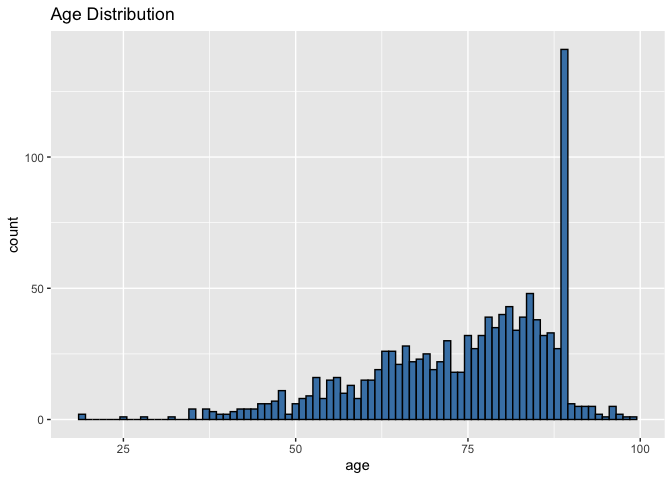<!-- -->

``` r
# Distribution of BMI (handling missing values)
ggplot(mortality_data %>% drop_na(bmi), aes(x = bmi)) +
  geom_histogram(binwidth = 1, fill = "darkgreen", color = "black") +
  ggtitle("BMI Distribution")
```

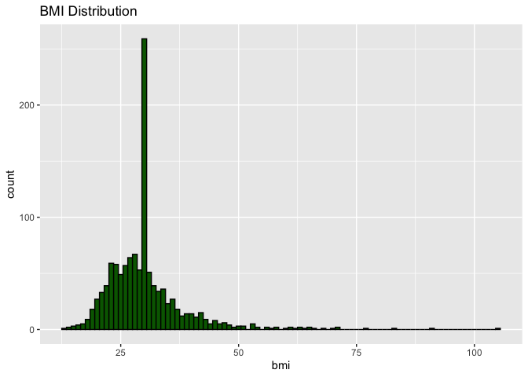<!-- -->

# Bivariate Analysis

``` r
# Bivariate Analysis
ggplot(mortality_data, aes(x = gender, y = age, fill = outcome)) +
  geom_boxplot() +
  ggtitle("Age Distribution by Gender and Outcome")
```

<!-- -->

**Age Distribution by Gender and Outcome:** The boxplots show the age
distribution for different genders and outcomes. We see that for both
genders, the age distribution for patients who did not survive
(outcome 1) is slightly higher. This could indicate that older age is a
risk factor for mortality in this patient group.

# Exploring Outcomes

``` r
# Age distribution by Outcome
ggplot(mortality_data, aes(x = age, fill = as.factor(outcome))) +
  geom_histogram(binwidth = 5, position = "dodge") +
  ggtitle("Age Distribution by Outcome")
```

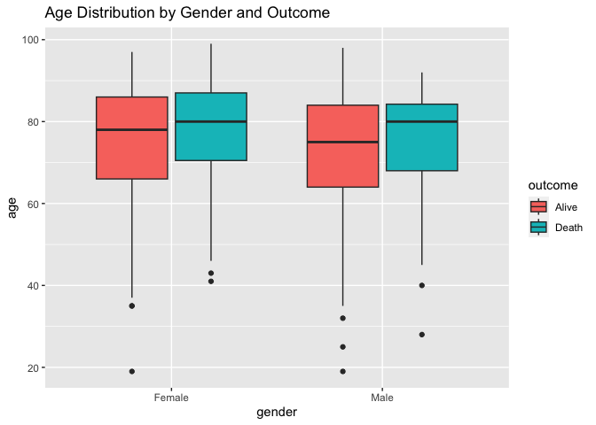<!-- -->

``` r
# Blood Pressure by Outcome
ggplot(mortality_data, aes(x = systolic_blood_pressure, y = diastolic_blood_pressure, color = as.factor(outcome))) +
  geom_point(alpha = 0.5) +
  ggtitle("Blood Pressure by Outcome")
```

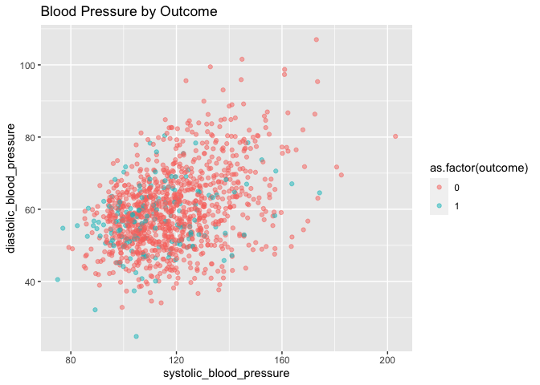<!-- -->

``` r
# BMI by Gender and Outcome
ggplot(mortality_data %>% drop_na(bmi), aes(x = bmi, fill = as.factor(outcome))) +
  geom_histogram(binwidth = 1, position = "dodge") +
  facet_wrap(~gender) +
  ggtitle("BMI by Gender and Outcome")
```

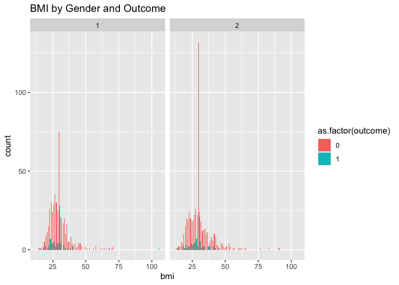<!-- -->

``` r
# Heart Rate by Outcome
ggplot(mortality_data, aes(x = heart_rate, fill = as.factor(outcome))) +
  geom_density(alpha = 0.7) +
  ggtitle("Heart Rate Distribution by Outcome")
```

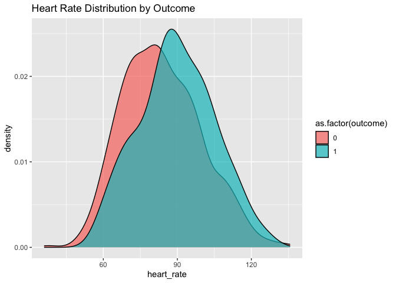<!-- -->

**Age Distribution by Outcome:**

The histogram shows the age distribution for the two outcomes. We
observe that the majority of patients are between 60 and 80 years old.
There is a noticeable overlap in the age distribution of patients who
survived and those who did not, suggesting that while age may be a
factor, it’s not the sole determinant of mortality.

**Blood Pressure by Outcome:**

This scatterplot shows systolic vs. diastolic blood pressure colored by
outcome. The points are widely spread, indicating variability in blood
pressure readings across the patient population. There doesn’t seem to
be a clear separation between the two outcomes based on blood pressure
alone.

**BMI by Gender and Outcome:**

It shows a wide range of BMI values for both genders, with no clear
pattern indicating that BMI is distinctly associated with the outcome.
However, there are more data points for BMI for outcome 0, which may
suggest a higher survival rate for patients with a lower BMI, although
further statistical analysis is needed.

**Heart Rate Distribution by Outcome:**

The density plot for heart rate shows that the distribution of heart
rates for patients who did not survive is slightly shifted towards the
higher end compared to those who survived. This could suggest that a
higher heart rate is associated with a higher risk of mortality.

# Comorbidities Analysis

``` r
# Analyzing the presence of comorbidities by outcome
comorbidities <- c("hypertensive", "diabetes", "deficiencyanemias", "depression", "renal_failure", "copd")

# Melt the data for easier plotting
mortality_long <- melt(mortality_data, id.vars = "outcome", measure.vars = comorbidities)
```

    ## Warning in melt(mortality_data, id.vars = "outcome", measure.vars =
    ## comorbidities): The melt generic in data.table has been passed a tbl_df and
    ## will attempt to redirect to the relevant reshape2 method; please note that
    ## reshape2 is deprecated, and this redirection is now deprecated as well. To
    ## continue using melt methods from reshape2 while both libraries are attached,
    ## e.g. melt.list, you can prepend the namespace like
    ## reshape2::melt(mortality_data). In the next version, this warning will become
    ## an error.

``` r
# Plotting comorbidities by outcome
ggplot(mortality_long, aes(x = variable, fill = as.factor(value))) +
  geom_bar(position = "fill") +
  facet_wrap(~outcome) +
  labs(x = "Comorbidity", y = "Count", fill = "Presence") +
  ggtitle("Distribution of Comorbidities by Outcome") +
  scale_y_continuous(labels = scales::percent)
```

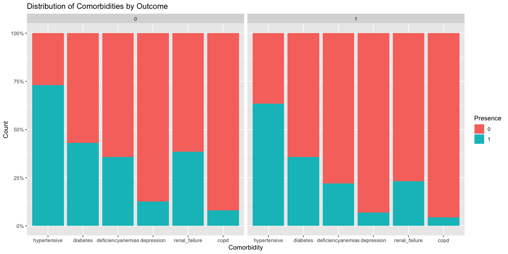<!-- -->

**Distribution of Comorbidities by Outcome:**

The stacked bar plot shows the distribution of comorbidities by outcome.
It appears that the proportion of patients with certain comorbidities
like renal failure and COPD is higher among non-survivors.

# Lab Results Analysis

``` r
# Creatinine levels by outcome
ggplot(mortality_data %>% drop_na(creatinine), aes(x = creatinine, fill = as.factor(outcome))) +
  geom_density(alpha = 0.5) +
  ggtitle("Creatinine Levels by Outcome")
```

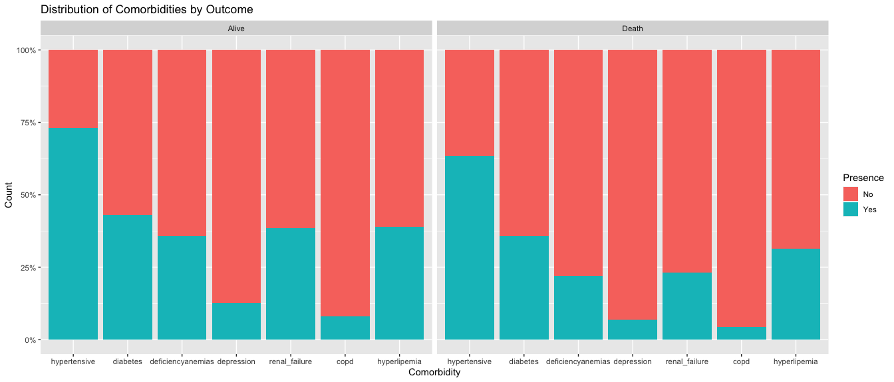<!-- -->

``` r
# Lactic acid levels by outcome
ggplot(mortality_data %>% drop_na(lactic_acid), aes(x = lactic_acid, fill = as.factor(outcome))) +
  geom_density(alpha = 0.5) +
  ggtitle("Lactic Acid Levels by Outcome")
```

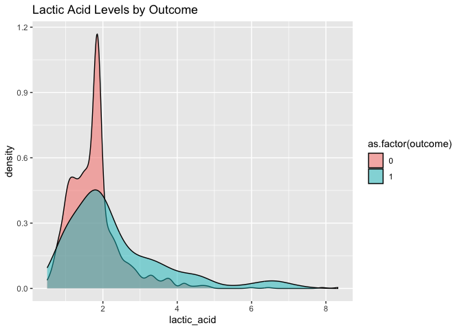<!-- -->

``` r
# Urea nitrogen levels by outcome
ggplot(mortality_data %>% drop_na(urea_nitrogen), aes(x = urea_nitrogen, fill = as.factor(outcome))) +
  geom_density(alpha = 0.5) +
  ggtitle("Blood Urea nitrogen Levels by Outcome")
```

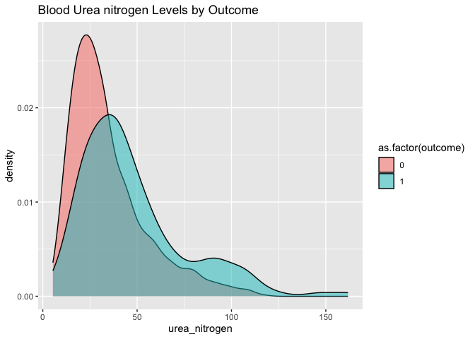<!-- -->

``` r
# Hematocrit levels by outcome
ggplot(mortality_data %>% drop_na(hematocrit), aes(x = hematocrit, fill = as.factor(outcome))) +
  geom_density(alpha = 0.5) +
  ggtitle("Hematocrit Levels by Outcome")
```

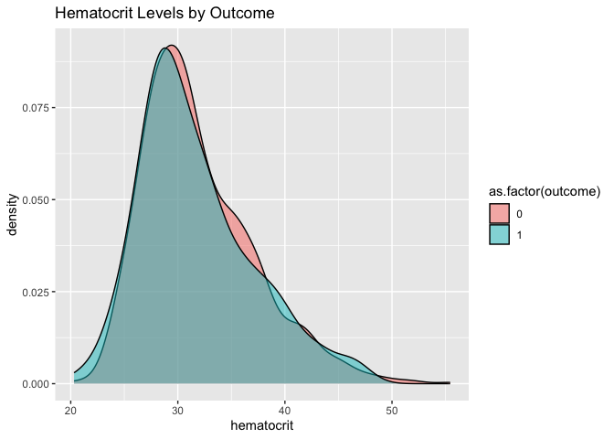<!-- -->

``` r
# Leucocyte count by outcome
ggplot(mortality_data %>% drop_na(leucocyte), aes(x = leucocyte, fill = as.factor(outcome))) +
  geom_density(alpha = 0.5) +
  ggtitle("Leucocyte Count by Outcome")
```

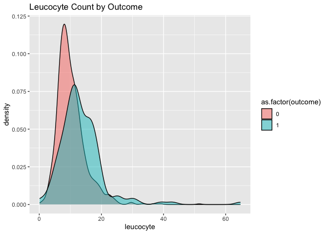<!-- -->

``` r
# Glucose levels by outcome
ggplot(mortality_data %>% drop_na(glucose), aes(x = glucose, fill = as.factor(outcome))) +
  geom_density(alpha = 0.5) +
  ggtitle("Glucose Levels by Outcome")
```

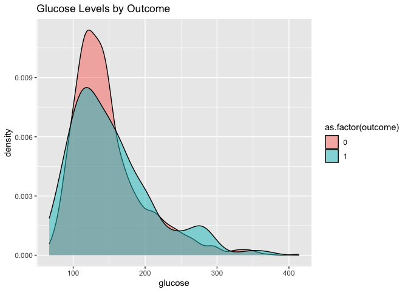<!-- -->

**Blood Urea Nitrogen Levels by Outcome:**

Patients with higher levels seem to have a poorer outcome, as indicated
by the longer tail in the distribution for non-survivors. High blood
urea nitrogen levels can be indicative of renal insufficiency or
failure, which is a known risk factor for mortality.

**Leucocyte Count by Outcome:**

The density plot shows a higher peak for leucocyte count among survivors
(outcome 0) compared to non-survivors (outcome 1). However, there is a
long tail in the distribution for non-survivors, suggesting that some
patients who did not survive had very high leucocyte counts, which could
indicate severe infection or systemic stress.

# Logistic Regression for Outcome Prediction

``` r
# Logistic regression to assess the impact of various factors on outcome
# Select relevant variables for the logistic regression model
logistic_model <- glm(outcome ~ age + gender + bmi + hypertensive + diabetes + renal_failure + leucocyte +
                        urea_nitrogen + heart_rate, 
                      data = mortality_data, family = binomial())

# Summary of the model to check for significant variables
summary(logistic_model)
```

    ## 
    ## Call:
    ## glm(formula = outcome ~ age + gender + bmi + hypertensive + diabetes + 
    ##     renal_failure + leucocyte + urea_nitrogen + heart_rate, family = binomial(), 
    ##     data = mortality_data)
    ## 
    ## Coefficients:
    ##                 Estimate Std. Error z value Pr(>|z|)    
    ## (Intercept)    -6.721637   1.088666  -6.174 6.65e-10 ***
    ## age             0.021188   0.008117   2.610  0.00905 ** 
    ## gender2        -0.066186   0.188303  -0.351  0.72522    
    ## bmi            -0.008810   0.013518  -0.652  0.51456    
    ## hypertensive1  -0.454324   0.201458  -2.255  0.02412 *  
    ## diabetes1      -0.174547   0.203969  -0.856  0.39214    
    ## renal_failure1 -1.293431   0.250874  -5.156 2.53e-07 ***
    ## leucocyte       0.066083   0.016067   4.113 3.91e-05 ***
    ## urea_nitrogen   0.036593   0.004541   8.058 7.73e-16 ***
    ## heart_rate      0.024365   0.006134   3.972 7.13e-05 ***
    ## ---
    ## Signif. codes:  0 '***' 0.001 '**' 0.01 '*' 0.05 '.' 0.1 ' ' 1
    ## 
    ## (Dispersion parameter for binomial family taken to be 1)
    ## 
    ##     Null deviance: 931.77  on 1175  degrees of freedom
    ## Residual deviance: 782.08  on 1166  degrees of freedom
    ## AIC: 802.08
    ## 
    ## Number of Fisher Scoring iterations: 5
