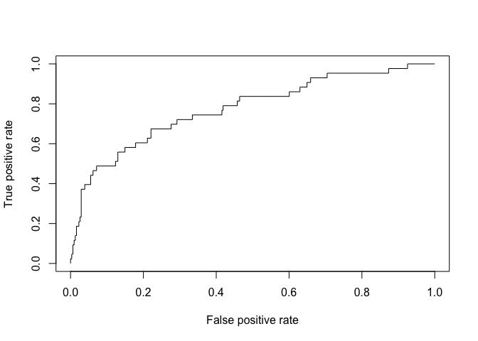

EDA_Zilly
================
lz2951
2023-11-29

``` r
library(tidyverse)
```

    ## ── Attaching core tidyverse packages ──────────────────────── tidyverse 2.0.0 ──
    ## ✔ dplyr     1.1.3     ✔ readr     2.1.4
    ## ✔ forcats   1.0.0     ✔ stringr   1.5.0
    ## ✔ ggplot2   3.4.3     ✔ tibble    3.2.1
    ## ✔ lubridate 1.9.2     ✔ tidyr     1.3.0
    ## ✔ purrr     1.0.2     
    ## ── Conflicts ────────────────────────────────────────── tidyverse_conflicts() ──
    ## ✖ dplyr::filter() masks stats::filter()
    ## ✖ dplyr::lag()    masks stats::lag()
    ## ℹ Use the conflicted package (<http://conflicted.r-lib.org/>) to force all conflicts to become errors

``` r
library(stargazer)
```

    ## 
    ## Please cite as: 
    ## 
    ##  Hlavac, Marek (2022). stargazer: Well-Formatted Regression and Summary Statistics Tables.
    ##  R package version 5.2.3. https://CRAN.R-project.org/package=stargazer

``` r
library(ROCR)
```

# Import data

``` r
mortality_cleaned = 
  read_csv("mortality_data_cleaned.csv") |>
  janitor::clean_names()
```

    ## Rows: 1176 Columns: 51
    ## ── Column specification ────────────────────────────────────────────────────────
    ## Delimiter: ","
    ## dbl (51): group, id, outcome, age, gender, bmi, hypertensive, atrialfibrilla...
    ## 
    ## ℹ Use `spec()` to retrieve the full column specification for this data.
    ## ℹ Specify the column types or set `show_col_types = FALSE` to quiet this message.

# Generalized linear model

## Generalized linear model for complete dataset (including both group1 and group2)

``` r
mortality_complete = 
  mortality_cleaned |>
  select(-group, -id)
```

``` r
glm_complete = glm(outcome ~ ., data = mortality_complete, family = binomial(link = logit))
```

``` r
stepwise_complete = step(glm_complete)
```

``` r
stargazer(stepwise_complete, type = "text")
```

    ## 
    ## ====================================================
    ##                              Dependent variable:    
    ##                          ---------------------------
    ##                                    outcome          
    ## ----------------------------------------------------
    ## age                                 0.014           
    ##                                    (0.009)          
    ##                                                     
    ## deficiencyanemias                 -0.654***         
    ##                                    (0.246)          
    ##                                                     
    ## renal_failure                     -1.142***         
    ##                                    (0.276)          
    ##                                                     
    ## copd                              -1.128**          
    ##                                    (0.461)          
    ##                                                     
    ## heart_rate                        0.023***          
    ##                                    (0.007)          
    ##                                                     
    ## diastolic_blood_pressure          -0.027**          
    ##                                    (0.012)          
    ##                                                     
    ## respiratory_rate                    0.040           
    ##                                    (0.028)          
    ##                                                     
    ## temperature                        -0.267           
    ##                                    (0.178)          
    ##                                                     
    ## sp_o2                             -0.097**          
    ##                                    (0.047)          
    ##                                                     
    ## urine_output                       -0.0002          
    ##                                   (0.0001)          
    ##                                                     
    ## mch                                0.082*           
    ##                                    (0.049)          
    ##                                                     
    ## mchc                               -0.203*          
    ##                                    (0.107)          
    ##                                                     
    ## rdw                                0.104**          
    ##                                    (0.052)          
    ##                                                     
    ## leucocyte                          0.049**          
    ##                                    (0.020)          
    ##                                                     
    ## platelets                         -0.003***         
    ##                                    (0.001)          
    ##                                                     
    ## lymphocyte                         -0.025           
    ##                                    (0.016)          
    ##                                                     
    ## creatinine                        -0.471***         
    ##                                    (0.182)          
    ##                                                     
    ## urea_nitrogen                     0.022***          
    ##                                    (0.007)          
    ##                                                     
    ## blood_potassium                     0.413           
    ##                                    (0.271)          
    ##                                                     
    ## blood_calcium                     -0.760***         
    ##                                    (0.209)          
    ##                                                     
    ## anion_gap                         0.206***          
    ##                                    (0.064)          
    ##                                                     
    ## magnesium_ion                      0.718*           
    ##                                    (0.431)          
    ##                                                     
    ## bicarbonate                       -0.082**          
    ##                                    (0.036)          
    ##                                                     
    ## pco2                              0.039***          
    ##                                    (0.013)          
    ##                                                     
    ## Constant                          19.259**          
    ##                                    (9.598)          
    ##                                                     
    ## ----------------------------------------------------
    ## Observations                        1,176           
    ## Log Likelihood                    -325.803          
    ## Akaike Inf. Crit.                  701.606          
    ## ====================================================
    ## Note:                    *p<0.1; **p<0.05; ***p<0.01

``` r
summary(stepwise_complete)
```

    ## 
    ## Call:
    ## glm(formula = outcome ~ age + deficiencyanemias + renal_failure + 
    ##     copd + heart_rate + diastolic_blood_pressure + respiratory_rate + 
    ##     temperature + sp_o2 + urine_output + mch + mchc + rdw + leucocyte + 
    ##     platelets + lymphocyte + creatinine + urea_nitrogen + blood_potassium + 
    ##     blood_calcium + anion_gap + magnesium_ion + bicarbonate + 
    ##     pco2, family = binomial(link = logit), data = mortality_complete)
    ## 
    ## Coefficients:
    ##                            Estimate Std. Error z value Pr(>|z|)    
    ## (Intercept)              19.2590819  9.5976046   2.007 0.044786 *  
    ## age                       0.0142918  0.0092707   1.542 0.123167    
    ## deficiencyanemias        -0.6541647  0.2460479  -2.659 0.007845 ** 
    ## renal_failure            -1.1423254  0.2764017  -4.133 3.58e-05 ***
    ## copd                     -1.1280987  0.4614429  -2.445 0.014496 *  
    ## heart_rate                0.0233167  0.0074780   3.118 0.001821 ** 
    ## diastolic_blood_pressure -0.0269256  0.0119484  -2.253 0.024228 *  
    ## respiratory_rate          0.0398045  0.0276286   1.441 0.149671    
    ## temperature              -0.2672547  0.1784731  -1.497 0.134276    
    ## sp_o2                    -0.0974804  0.0470036  -2.074 0.038089 *  
    ## urine_output             -0.0001652  0.0001068  -1.546 0.122030    
    ## mch                       0.0818651  0.0494141   1.657 0.097577 .  
    ## mchc                     -0.2032528  0.1071511  -1.897 0.057844 .  
    ## rdw                       0.1040846  0.0515905   2.018 0.043642 *  
    ## leucocyte                 0.0490760  0.0204623   2.398 0.016469 *  
    ## platelets                -0.0032973  0.0010162  -3.245 0.001175 ** 
    ## lymphocyte               -0.0252952  0.0163700  -1.545 0.122294    
    ## creatinine               -0.4714431  0.1819376  -2.591 0.009563 ** 
    ## urea_nitrogen             0.0218553  0.0072053   3.033 0.002420 ** 
    ## blood_potassium           0.4128049  0.2706920   1.525 0.127259    
    ## blood_calcium            -0.7597361  0.2087830  -3.639 0.000274 ***
    ## anion_gap                 0.2062723  0.0640473   3.221 0.001279 ** 
    ## magnesium_ion             0.7178665  0.4305826   1.667 0.095475 .  
    ## bicarbonate              -0.0817167  0.0357449  -2.286 0.022248 *  
    ## pco2                      0.0393260  0.0126945   3.098 0.001949 ** 
    ## ---
    ## Signif. codes:  0 '***' 0.001 '**' 0.01 '*' 0.05 '.' 0.1 ' ' 1
    ## 
    ## (Dispersion parameter for binomial family taken to be 1)
    ## 
    ##     Null deviance: 931.77  on 1175  degrees of freedom
    ## Residual deviance: 651.61  on 1151  degrees of freedom
    ## AIC: 701.61
    ## 
    ## Number of Fisher Scoring iterations: 6

## Generalized linear model for derivation dataset (group1)

``` r
mortality_derivation =
  mortality_cleaned |>
  filter(group == 1) |>
  select(-group, -id) 
```

``` r
glm_derivation = glm(outcome ~ ., data = mortality_derivation, family = binomial(link = logit))
```

``` r
stepwise_derivation = step(glm_derivation)
```

``` r
stargazer(stepwise_derivation, type = "text")
```

    ## 
    ## ====================================================
    ##                              Dependent variable:    
    ##                          ---------------------------
    ##                                    outcome          
    ## ----------------------------------------------------
    ## age                                0.025**          
    ##                                    (0.012)          
    ##                                                     
    ## gender                             -0.377           
    ##                                    (0.261)          
    ##                                                     
    ## hypertensive                       -0.426           
    ##                                    (0.279)          
    ##                                                     
    ## atrialfibrillation                 0.455*           
    ##                                    (0.268)          
    ##                                                     
    ## diabetes                           -0.479*          
    ##                                    (0.278)          
    ##                                                     
    ## deficiencyanemias                 -0.634**          
    ##                                    (0.298)          
    ##                                                     
    ## hyperlipemia                       -0.441           
    ##                                    (0.288)          
    ##                                                     
    ## renal_failure                     -0.894***         
    ##                                    (0.333)          
    ##                                                     
    ## copd                              -1.513**          
    ##                                    (0.617)          
    ##                                                     
    ## heart_rate                        0.026***          
    ##                                    (0.008)          
    ##                                                     
    ## diastolic_blood_pressure          -0.037**          
    ##                                    (0.015)          
    ##                                                     
    ## sp_o2                             -0.108**          
    ##                                    (0.052)          
    ##                                                     
    ## mcv                                0.046**          
    ##                                    (0.019)          
    ##                                                     
    ## rdw                                0.120**          
    ##                                    (0.057)          
    ##                                                     
    ## platelets                         -0.002**          
    ##                                    (0.001)          
    ##                                                     
    ## lymphocyte                        -0.042**          
    ##                                    (0.020)          
    ##                                                     
    ## creatinine                        -0.646***         
    ##                                    (0.217)          
    ##                                                     
    ## urea_nitrogen                     0.032***          
    ##                                    (0.008)          
    ##                                                     
    ## blood_calcium                     -0.942***         
    ##                                    (0.234)          
    ##                                                     
    ## anion_gap                         0.310***          
    ##                                    (0.075)          
    ##                                                     
    ## lactic_acid                        0.277*           
    ##                                    (0.145)          
    ##                                                     
    ## pco2                              0.037***          
    ##                                    (0.013)          
    ##                                                     
    ## Constant                            4.049           
    ##                                    (6.223)          
    ##                                                     
    ## ----------------------------------------------------
    ## Observations                         825            
    ## Log Likelihood                    -228.171          
    ## Akaike Inf. Crit.                  502.343          
    ## ====================================================
    ## Note:                    *p<0.1; **p<0.05; ***p<0.01

``` r
summary(stepwise_derivation)
```

    ## 
    ## Call:
    ## glm(formula = outcome ~ age + gender + hypertensive + atrialfibrillation + 
    ##     diabetes + deficiencyanemias + hyperlipemia + renal_failure + 
    ##     copd + heart_rate + diastolic_blood_pressure + sp_o2 + mcv + 
    ##     rdw + platelets + lymphocyte + creatinine + urea_nitrogen + 
    ##     blood_calcium + anion_gap + lactic_acid + pco2, family = binomial(link = logit), 
    ##     data = mortality_derivation)
    ## 
    ## Coefficients:
    ##                           Estimate Std. Error z value Pr(>|z|)    
    ## (Intercept)               4.049211   6.223323   0.651  0.51527    
    ## age                       0.024527   0.011691   2.098  0.03592 *  
    ## gender                   -0.377370   0.261083  -1.445  0.14835    
    ## hypertensive             -0.425550   0.279079  -1.525  0.12730    
    ## atrialfibrillation        0.454825   0.267560   1.700  0.08915 .  
    ## diabetes                 -0.478653   0.278206  -1.720  0.08534 .  
    ## deficiencyanemias        -0.633530   0.297759  -2.128  0.03337 *  
    ## hyperlipemia             -0.440532   0.288308  -1.528  0.12652    
    ## renal_failure            -0.894474   0.333213  -2.684  0.00727 ** 
    ## copd                     -1.513432   0.617326  -2.452  0.01422 *  
    ## heart_rate                0.025778   0.008322   3.098  0.00195 ** 
    ## diastolic_blood_pressure -0.037489   0.014559  -2.575  0.01003 *  
    ## sp_o2                    -0.107812   0.052481  -2.054  0.03994 *  
    ## mcv                       0.045993   0.019129   2.404  0.01620 *  
    ## rdw                       0.120262   0.056611   2.124  0.03364 *  
    ## platelets                -0.002308   0.001173  -1.967  0.04916 *  
    ## lymphocyte               -0.042492   0.019659  -2.161  0.03066 *  
    ## creatinine               -0.646281   0.216766  -2.981  0.00287 ** 
    ## urea_nitrogen             0.032267   0.008076   3.995 6.46e-05 ***
    ## blood_calcium            -0.942475   0.234124  -4.026 5.68e-05 ***
    ## anion_gap                 0.310417   0.075475   4.113 3.91e-05 ***
    ## lactic_acid               0.276861   0.144762   1.913  0.05581 .  
    ## pco2                      0.036983   0.013154   2.811  0.00493 ** 
    ## ---
    ## Signif. codes:  0 '***' 0.001 '**' 0.01 '*' 0.05 '.' 0.1 ' ' 1
    ## 
    ## (Dispersion parameter for binomial family taken to be 1)
    ## 
    ##     Null deviance: 670.00  on 824  degrees of freedom
    ## Residual deviance: 456.34  on 802  degrees of freedom
    ## AIC: 502.34
    ## 
    ## Number of Fisher Scoring iterations: 6

## Model evaluation in validation group (group2)

``` r
mortality_validation =
  mortality_cleaned |>
  filter(group == 2) |>
  select(-group, -id) 
```

``` r
predict = predict(stepwise_derivation, newdata = mortality_validation, type = "response")
```

``` r
pred = prediction(predictions = predict, labels = mortality_validation$outcome)
roc = performance(pred, "tpr", "fpr")
auc = performance(pred, measure = "auc")@y.values[[1]]
```

``` r
plot(roc, colorize = F)
```

<!-- -->

``` r
cat('AUC of the model on validation dataset:', auc)
```

    ## AUC of the model on validation dataset: 0.7757475
