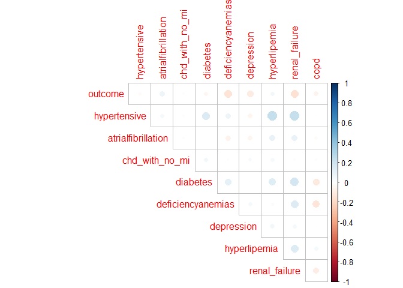
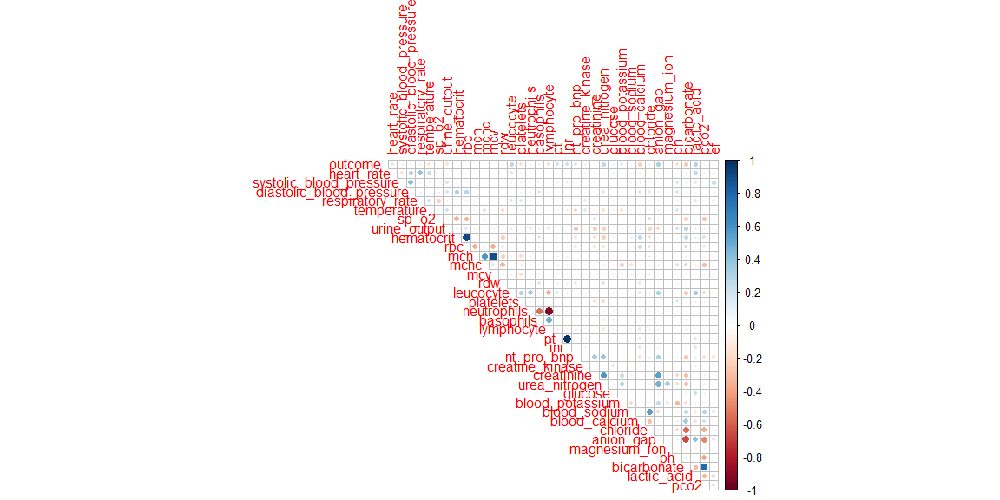
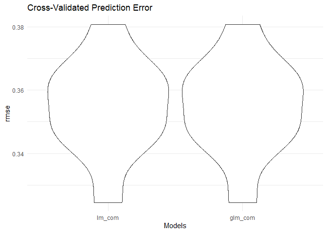
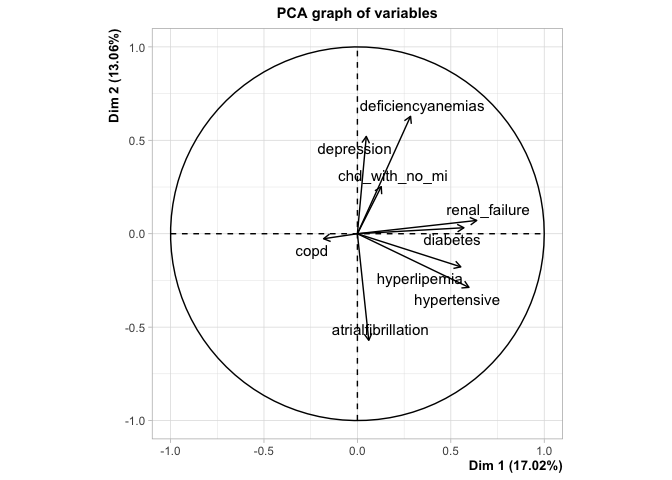
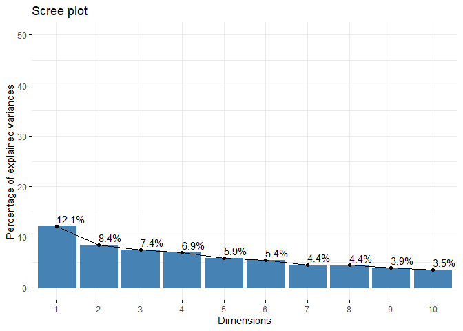
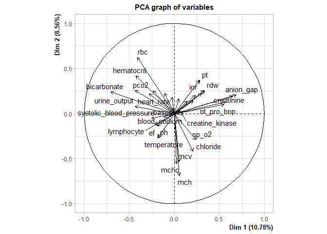

Felix_EDA
================
Yifei Liu
2023/11/25

``` r
library(tidyverse)
library(corrplot)
```

    ## Warning: 程辑包'corrplot'是用R版本4.3.2 来建造的

``` r
library(FactoMineR)
```

    ## Warning: 程辑包'FactoMineR'是用R版本4.3.2 来建造的

``` r
library(factoextra)
```

    ## Warning: 程辑包'factoextra'是用R版本4.3.2 来建造的

``` r
mort_data = 
  read_csv("./data/data01.csv") |> 
  janitor::clean_names() |> 
  drop_na() |>
  rename(gender = gendera) |>
  select(-group, everything())
```

    ## Rows: 1177 Columns: 51
    ## ── Column specification ────────────────────────────────────────────────────────
    ## Delimiter: ","
    ## dbl (51): group, ID, outcome, age, gendera, BMI, hypertensive, atrialfibrill...
    ## 
    ## ℹ Use `spec()` to retrieve the full column specification for this data.
    ## ℹ Specify the column types or set `show_col_types = FALSE` to quiet this message.

``` r
com_data =
  mort_data |>
  select(outcome, hypertensive:copd)
corrplot(cor(com_data), type = "upper", diag = FALSE)
```

<!-- -->

``` r
sign_data =
  mort_data |>
  select(outcome, heart_rate:ef)
corrplot(cor(sign_data), type = "upper", diag = FALSE)
```

<!-- -->

``` r
#linear model
model_com = lm(outcome ~ ., data = com_data)
summary(model_com)
```

    ## 
    ## Call:
    ## lm(formula = outcome ~ ., data = com_data)
    ## 
    ## Residuals:
    ##      Min       1Q   Median       3Q      Max 
    ## -0.32830 -0.20466 -0.12136 -0.02148  1.01752 
    ## 
    ## Coefficients:
    ##                      Estimate Std. Error t value Pr(>|t|)    
    ## (Intercept)         0.2198379  0.0392355   5.603 3.83e-08 ***
    ## hypertensive        0.0001215  0.0393247   0.003  0.99754    
    ## atrialfibrillation  0.0456107  0.0347481   1.313  0.19003    
    ## chd_with_no_mi      0.0147951  0.0675368   0.219  0.82671    
    ## diabetes           -0.0212910  0.0352963  -0.603  0.54670    
    ## deficiencyanemias  -0.0984749  0.0367507  -2.680  0.00766 ** 
    ## depression         -0.0999789  0.0506174  -1.975  0.04890 *  
    ## hyperlipemia        0.0627292  0.0372621   1.683  0.09303 .  
    ## renal_failure      -0.1177161  0.0373055  -3.155  0.00172 ** 
    ## copd               -0.1243063  0.0613849  -2.025  0.04350 *  
    ## ---
    ## Signif. codes:  0 '***' 0.001 '**' 0.01 '*' 0.05 '.' 0.1 ' ' 1
    ## 
    ## Residual standard error: 0.35 on 418 degrees of freedom
    ## Multiple R-squared:  0.07095,    Adjusted R-squared:  0.05094 
    ## F-statistic: 3.547 on 9 and 418 DF,  p-value: 0.0002942

``` r
com_names = 
  com_data |>
  select(hypertensive:copd) |>
  colnames()

fit1_com_res = tibble()

fit1_lm = function(v, com_data){
  model = lm(outcome ~ v, data = com_data)
  result = summary(res) |>
    broom::tidy() |>
    slice(1)
  bind_rows(fit1_com_res, result)
}

#fit1_com = map_dfr(renal_failure, ~ fit1_lm(.x, com_data), .id = "model")

fit1_com = lm(outcome ~ renal_failure, data = com_data)

summary(fit1_com) |>
  broom::tidy()
```

    ## # A tibble: 2 × 5
    ##   term          estimate std.error statistic  p.value
    ##   <chr>            <dbl>     <dbl>     <dbl>    <dbl>
    ## 1 (Intercept)      0.196    0.0216      9.07 4.53e-18
    ## 2 renal_failure   -0.119    0.0356     -3.35 8.95e- 4

``` r
#generalized linear model
model_com_glm = glm(outcome ~ ., data = com_data)
summary(model_com_glm)
```

    ## 
    ## Call:
    ## glm(formula = outcome ~ ., data = com_data)
    ## 
    ## Coefficients:
    ##                      Estimate Std. Error t value Pr(>|t|)    
    ## (Intercept)         0.2198379  0.0392355   5.603 3.83e-08 ***
    ## hypertensive        0.0001215  0.0393247   0.003  0.99754    
    ## atrialfibrillation  0.0456107  0.0347481   1.313  0.19003    
    ## chd_with_no_mi      0.0147951  0.0675368   0.219  0.82671    
    ## diabetes           -0.0212910  0.0352963  -0.603  0.54670    
    ## deficiencyanemias  -0.0984749  0.0367507  -2.680  0.00766 ** 
    ## depression         -0.0999789  0.0506174  -1.975  0.04890 *  
    ## hyperlipemia        0.0627292  0.0372621   1.683  0.09303 .  
    ## renal_failure      -0.1177161  0.0373055  -3.155  0.00172 ** 
    ## copd               -0.1243063  0.0613849  -2.025  0.04350 *  
    ## ---
    ## Signif. codes:  0 '***' 0.001 '**' 0.01 '*' 0.05 '.' 0.1 ' ' 1
    ## 
    ## (Dispersion parameter for gaussian family taken to be 0.1225295)
    ## 
    ##     Null deviance: 55.129  on 427  degrees of freedom
    ## Residual deviance: 51.217  on 418  degrees of freedom
    ## AIC: 327.95
    ## 
    ## Number of Fisher Scoring iterations: 2

``` r
fit1_com_glm = glm(outcome ~ renal_failure, data = com_data, family = binomial(link = "logit"))

summary(fit1_com_glm)
```

    ## 
    ## Call:
    ## glm(formula = outcome ~ renal_failure, family = binomial(link = "logit"), 
    ##     data = com_data)
    ## 
    ## Coefficients:
    ##               Estimate Std. Error z value Pr(>|z|)    
    ## (Intercept)    -1.4142     0.1532  -9.234  < 2e-16 ***
    ## renal_failure  -1.0776     0.3372  -3.196  0.00139 ** 
    ## ---
    ## Signif. codes:  0 '***' 0.001 '**' 0.01 '*' 0.05 '.' 0.1 ' ' 1
    ## 
    ## (Dispersion parameter for binomial family taken to be 1)
    ## 
    ##     Null deviance: 364.60  on 427  degrees of freedom
    ## Residual deviance: 352.63  on 426  degrees of freedom
    ## AIC: 356.63
    ## 
    ## Number of Fisher Scoring iterations: 5

``` r
model_sign = lm(outcome ~ ., data = sign_data)
summary(model_sign)
```

    ## 
    ## Call:
    ## lm(formula = outcome ~ ., data = sign_data)
    ## 
    ## Residuals:
    ##      Min       1Q   Median       3Q      Max 
    ## -0.81157 -0.15819 -0.05615  0.06137  1.00206 
    ## 
    ## Coefficients:
    ##                            Estimate Std. Error t value Pr(>|t|)    
    ## (Intercept)              -6.908e-01  5.418e+00  -0.128 0.898603    
    ## heart_rate                2.568e-03  1.163e-03   2.207 0.027860 *  
    ## systolic_blood_pressure   1.089e-03  1.148e-03   0.948 0.343461    
    ## diastolic_blood_pressure -3.865e-03  2.104e-03  -1.837 0.066993 .  
    ## respiratory_rate          5.500e-03  4.045e-03   1.360 0.174699    
    ## temperature              -6.320e-02  2.651e-02  -2.384 0.017602 *  
    ## sp_o2                     3.261e-03  6.738e-03   0.484 0.628683    
    ## urine_output             -9.946e-06  1.324e-05  -0.751 0.453092    
    ## hematocrit               -1.539e-02  2.538e-02  -0.606 0.544692    
    ## rbc                       1.692e-01  2.260e-01   0.749 0.454550    
    ## mch                       5.313e-03  1.427e-01   0.037 0.970320    
    ## mchc                     -2.529e-03  1.260e-01  -0.020 0.983991    
    ## mcv                       6.175e-03  4.926e-02   0.125 0.900312    
    ## rdw                      -4.786e-04  8.610e-03  -0.056 0.955703    
    ## leucocyte                 8.019e-03  3.519e-03   2.279 0.023230 *  
    ## platelets                -5.278e-04  1.614e-04  -3.271 0.001166 ** 
    ## neutrophils              -5.184e-03  4.022e-03  -1.289 0.198183    
    ## basophils                 6.996e-03  5.776e-02   0.121 0.903645    
    ## lymphocyte               -7.457e-03  4.839e-03  -1.541 0.124108    
    ## pt                       -1.264e-03  1.838e-02  -0.069 0.945224    
    ## inr                       5.143e-02  1.593e-01   0.323 0.746974    
    ## nt_pro_bnp                1.307e-06  1.273e-06   1.027 0.305065    
    ## creatine_kinase           4.476e-06  6.928e-06   0.646 0.518580    
    ## creatinine               -7.039e-02  1.794e-02  -3.925 0.000103 ***
    ## urea_nitrogen             2.379e-03  1.097e-03   2.168 0.030795 *  
    ## glucose                   2.724e-04  2.977e-04   0.915 0.360746    
    ## blood_potassium          -2.574e-02  6.656e-02  -0.387 0.699194    
    ## blood_sodium             -4.253e-02  4.549e-02  -0.935 0.350384    
    ## blood_calcium            -8.357e-02  3.169e-02  -2.637 0.008700 ** 
    ## chloride                  4.087e-02  4.514e-02   0.905 0.365866    
    ## anion_gap                 7.424e-02  4.651e-02   1.596 0.111264    
    ## magnesium_ion             3.969e-02  6.898e-02   0.575 0.565333    
    ## ph                        3.394e-01  3.990e-01   0.851 0.395469    
    ## bicarbonate               2.763e-02  4.595e-02   0.601 0.548016    
    ## lactic_acid               3.396e-02  2.029e-02   1.674 0.094969 .  
    ## pco2                      9.115e-03  3.158e-03   2.886 0.004119 ** 
    ## ef                        9.935e-04  1.279e-03   0.777 0.437756    
    ## ---
    ## Signif. codes:  0 '***' 0.001 '**' 0.01 '*' 0.05 '.' 0.1 ' ' 1
    ## 
    ## Residual standard error: 0.3021 on 391 degrees of freedom
    ## Multiple R-squared:  0.3525, Adjusted R-squared:  0.2929 
    ## F-statistic: 5.913 on 36 and 391 DF,  p-value: < 2.2e-16

``` r
#pca_com
com_names = 
  com_data |>
  select(hypertensive:copd) |>
  colnames()

vars_com = com_data[, com_names]
pca_res_com = prcomp(vars_com, scale. = TRUE)
summary(pca_res_com)
```

    ## Importance of components:
    ##                          PC1    PC2    PC3    PC4    PC5     PC6     PC7
    ## Standard deviation     1.283 1.0892 1.0317 1.0105 0.9860 0.91947 0.89345
    ## Proportion of Variance 0.183 0.1318 0.1183 0.1135 0.1080 0.09394 0.08869
    ## Cumulative Proportion  0.183 0.3148 0.4331 0.5465 0.6546 0.74849 0.83719
    ##                            PC8     PC9
    ## Standard deviation     0.88552 0.82534
    ## Proportion of Variance 0.08713 0.07569
    ## Cumulative Proportion  0.92431 1.00000

``` r
res_pca_com = PCA(com_data, graph = FALSE)
fviz_eig(res_pca_com, addlabels = TRUE, ylim = c(0, 50))
```

<!-- -->

``` r
fviz_pca_var(res_pca_com, col.var = "black")
```

<!-- -->

``` r
#pca_sign
sign_names = 
  sign_data |>
  select(heart_rate:ef) |>
  colnames()

vars_sign = sign_data[, sign_names]
pca_res_sign = prcomp(vars_sign, scale. = TRUE)
summary(pca_res_sign)
```

    ## Importance of components:
    ##                           PC1    PC2     PC3    PC4     PC5     PC6     PC7
    ## Standard deviation     2.0755 1.7544 1.65941 1.5954 1.44825 1.41361 1.28211
    ## Proportion of Variance 0.1197 0.0855 0.07649 0.0707 0.05826 0.05551 0.04566
    ## Cumulative Proportion  0.1197 0.2052 0.28165 0.3524 0.41062 0.46613 0.51179
    ##                            PC8     PC9    PC10   PC11    PC12    PC13    PC14
    ## Standard deviation     1.26893 1.20539 1.13669 1.0732 1.06219 1.01594 0.97637
    ## Proportion of Variance 0.04473 0.04036 0.03589 0.0320 0.03134 0.02867 0.02648
    ## Cumulative Proportion  0.55652 0.59688 0.63277 0.6648 0.69610 0.72477 0.75125
    ##                          PC15    PC16    PC17    PC18    PC19    PC20    PC21
    ## Standard deviation     0.9411 0.93071 0.91478 0.88614 0.81928 0.78031 0.77131
    ## Proportion of Variance 0.0246 0.02406 0.02325 0.02181 0.01864 0.01691 0.01653
    ## Cumulative Proportion  0.7759 0.79992 0.82316 0.84498 0.86362 0.88053 0.89706
    ##                           PC22    PC23   PC24    PC25    PC26    PC27    PC28
    ## Standard deviation     0.74955 0.72039 0.7024 0.66146 0.64995 0.60204 0.52594
    ## Proportion of Variance 0.01561 0.01442 0.0137 0.01215 0.01173 0.01007 0.00768
    ## Cumulative Proportion  0.91267 0.92708 0.9408 0.95294 0.96467 0.97474 0.98242
    ##                           PC29    PC30    PC31    PC32    PC33    PC34    PC35
    ## Standard deviation     0.51135 0.46246 0.27123 0.26514 0.07778 0.07365 0.03573
    ## Proportion of Variance 0.00726 0.00594 0.00204 0.00195 0.00017 0.00015 0.00004
    ## Cumulative Proportion  0.98969 0.99563 0.99767 0.99962 0.99979 0.99994 0.99998
    ##                           PC36
    ## Standard deviation     0.02754
    ## Proportion of Variance 0.00002
    ## Cumulative Proportion  1.00000

``` r
res_pca_sign = PCA(sign_data, graph = FALSE)
fviz_eig(res_pca_sign, addlabels = TRUE, ylim = c(0, 50))
```

<!-- -->

``` r
fviz_pca_var(res_pca_sign, col.var = "black")
```

<!-- -->
