Felix_EDA
================
Yifei Liu
2023/11/25

``` r
library(tidyverse)
library(modelr)
library(purrr)
library(corrplot)
```

    ## Warning: 程辑包'corrplot'是用R版本4.3.2 来建造的

``` r
library(FactoMineR)
```

    ## Warning: 程辑包'FactoMineR'是用R版本4.3.2 来建造的

``` r
library(factoextra)
```

    ## Warning: 程辑包'factoextra'是用R版本4.3.2 来建造的

``` r
#load mortality dataset
mort_data = 
  read_csv("mortality_data.csv") |> 
  janitor::clean_names() |> 
  drop_na() |>
  rename(gender = gendera) |>
  select(-group, everything())
```

    ## Rows: 1177 Columns: 51
    ## ── Column specification ────────────────────────────────────────────────────────
    ## Delimiter: ","
    ## dbl (51): group, ID, outcome, age, gendera, BMI, hypertensive, atrialfibrill...
    ## 
    ## ℹ Use `spec()` to retrieve the full column specification for this data.
    ## ℹ Specify the column types or set `show_col_types = FALSE` to quiet this message.

``` r
#select patient outcome and complications
com_data =
  mort_data |>
  select(outcome, hypertensive:copd)
#show correlation
corrplot(cor(com_data), type = "upper", diag = FALSE)
```

<!-- -->

Interpretation:  
- `outcome` seems strongly connected with `deficiencyanemias`,
`renal_failure`.  - `hypertensive` shows strong correlation with
`hyperlipemia` and `renal_failure`.  
- `diabetes` shows strong correlation with `renal_failure`.  
- `hyperlipemia` also shows strong correlation with `renal_failure`.  

``` r
#select patient outcome and vital signs
sign_data =
  mort_data |>
  select(outcome, heart_rate:ef)
#show correlation
corrplot(cor(sign_data), type = "upper", diag = FALSE)
```

<!-- -->

``` r
#linear model for complications
model_com = lm(outcome ~ ., data = com_data)
summary(model_com)
```

    ## 
    ## Call:
    ## lm(formula = outcome ~ ., data = com_data)
    ## 
    ## Residuals:
    ##      Min       1Q   Median       3Q      Max 
    ## -0.32830 -0.20466 -0.12136 -0.02148  1.01752 
    ## 
    ## Coefficients:
    ##                      Estimate Std. Error t value Pr(>|t|)    
    ## (Intercept)         0.2198379  0.0392355   5.603 3.83e-08 ***
    ## hypertensive        0.0001215  0.0393247   0.003  0.99754    
    ## atrialfibrillation  0.0456107  0.0347481   1.313  0.19003    
    ## chd_with_no_mi      0.0147951  0.0675368   0.219  0.82671    
    ## diabetes           -0.0212910  0.0352963  -0.603  0.54670    
    ## deficiencyanemias  -0.0984749  0.0367507  -2.680  0.00766 ** 
    ## depression         -0.0999789  0.0506174  -1.975  0.04890 *  
    ## hyperlipemia        0.0627292  0.0372621   1.683  0.09303 .  
    ## renal_failure      -0.1177161  0.0373055  -3.155  0.00172 ** 
    ## copd               -0.1243063  0.0613849  -2.025  0.04350 *  
    ## ---
    ## Signif. codes:  0 '***' 0.001 '**' 0.01 '*' 0.05 '.' 0.1 ' ' 1
    ## 
    ## Residual standard error: 0.35 on 418 degrees of freedom
    ## Multiple R-squared:  0.07095,    Adjusted R-squared:  0.05094 
    ## F-statistic: 3.547 on 9 and 418 DF,  p-value: 0.0002942

``` r
model_com_se = lm(outcome ~ ., data = com_data) |>
  step(direction = "both", trace = FALSE)
summary(model_com_se)
```

    ## 
    ## Call:
    ## lm(formula = outcome ~ deficiencyanemias + depression + hyperlipemia + 
    ##     renal_failure + copd, data = com_data)
    ## 
    ## Residuals:
    ##      Min       1Q   Median       3Q      Max 
    ## -0.29650 -0.23169 -0.12110 -0.01051  0.98949 
    ## 
    ## Coefficients:
    ##                   Estimate Std. Error t value Pr(>|t|)    
    ## (Intercept)        0.23169    0.02720   8.519 2.88e-16 ***
    ## deficiencyanemias -0.10439    0.03641  -2.867  0.00435 ** 
    ## depression        -0.10263    0.05023  -2.043  0.04164 *  
    ## hyperlipemia       0.06481    0.03602   1.799  0.07274 .  
    ## renal_failure     -0.11679    0.03593  -3.251  0.00124 ** 
    ## copd              -0.12366    0.06089  -2.031  0.04289 *  
    ## ---
    ## Signif. codes:  0 '***' 0.001 '**' 0.01 '*' 0.05 '.' 0.1 ' ' 1
    ## 
    ## Residual standard error: 0.3493 on 422 degrees of freedom
    ## Multiple R-squared:  0.06612,    Adjusted R-squared:  0.05505 
    ## F-statistic: 5.975 on 5 and 422 DF,  p-value: 2.352e-05

``` r
#generalized linear model for complications
model_com_glm = glm(outcome ~ ., data = com_data)
summary(model_com_glm)
```

    ## 
    ## Call:
    ## glm(formula = outcome ~ ., data = com_data)
    ## 
    ## Coefficients:
    ##                      Estimate Std. Error t value Pr(>|t|)    
    ## (Intercept)         0.2198379  0.0392355   5.603 3.83e-08 ***
    ## hypertensive        0.0001215  0.0393247   0.003  0.99754    
    ## atrialfibrillation  0.0456107  0.0347481   1.313  0.19003    
    ## chd_with_no_mi      0.0147951  0.0675368   0.219  0.82671    
    ## diabetes           -0.0212910  0.0352963  -0.603  0.54670    
    ## deficiencyanemias  -0.0984749  0.0367507  -2.680  0.00766 ** 
    ## depression         -0.0999789  0.0506174  -1.975  0.04890 *  
    ## hyperlipemia        0.0627292  0.0372621   1.683  0.09303 .  
    ## renal_failure      -0.1177161  0.0373055  -3.155  0.00172 ** 
    ## copd               -0.1243063  0.0613849  -2.025  0.04350 *  
    ## ---
    ## Signif. codes:  0 '***' 0.001 '**' 0.01 '*' 0.05 '.' 0.1 ' ' 1
    ## 
    ## (Dispersion parameter for gaussian family taken to be 0.1225295)
    ## 
    ##     Null deviance: 55.129  on 427  degrees of freedom
    ## Residual deviance: 51.217  on 418  degrees of freedom
    ## AIC: 327.95
    ## 
    ## Number of Fisher Scoring iterations: 2

``` r
model_com_glm_se = glm(outcome ~ ., data = com_data) |>
  step(direction = "both", trace = FALSE)
summary(model_com_glm_se)
```

    ## 
    ## Call:
    ## glm(formula = outcome ~ deficiencyanemias + depression + hyperlipemia + 
    ##     renal_failure + copd, data = com_data)
    ## 
    ## Coefficients:
    ##                   Estimate Std. Error t value Pr(>|t|)    
    ## (Intercept)        0.23169    0.02720   8.519 2.88e-16 ***
    ## deficiencyanemias -0.10439    0.03641  -2.867  0.00435 ** 
    ## depression        -0.10263    0.05023  -2.043  0.04164 *  
    ## hyperlipemia       0.06481    0.03602   1.799  0.07274 .  
    ## renal_failure     -0.11679    0.03593  -3.251  0.00124 ** 
    ## copd              -0.12366    0.06089  -2.031  0.04289 *  
    ## ---
    ## Signif. codes:  0 '***' 0.001 '**' 0.01 '*' 0.05 '.' 0.1 ' ' 1
    ## 
    ## (Dispersion parameter for gaussian family taken to be 0.1219991)
    ## 
    ##     Null deviance: 55.129  on 427  degrees of freedom
    ## Residual deviance: 51.484  on 422  degrees of freedom
    ## AIC: 322.17
    ## 
    ## Number of Fisher Scoring iterations: 2

``` r
#linear model for vital signs
model_sign = lm(outcome ~ ., data = sign_data)
summary(model_sign)
```

    ## 
    ## Call:
    ## lm(formula = outcome ~ ., data = sign_data)
    ## 
    ## Residuals:
    ##      Min       1Q   Median       3Q      Max 
    ## -0.81157 -0.15819 -0.05615  0.06137  1.00206 
    ## 
    ## Coefficients:
    ##                            Estimate Std. Error t value Pr(>|t|)    
    ## (Intercept)              -6.908e-01  5.418e+00  -0.128 0.898603    
    ## heart_rate                2.568e-03  1.163e-03   2.207 0.027860 *  
    ## systolic_blood_pressure   1.089e-03  1.148e-03   0.948 0.343461    
    ## diastolic_blood_pressure -3.865e-03  2.104e-03  -1.837 0.066993 .  
    ## respiratory_rate          5.500e-03  4.045e-03   1.360 0.174699    
    ## temperature              -6.320e-02  2.651e-02  -2.384 0.017602 *  
    ## sp_o2                     3.261e-03  6.738e-03   0.484 0.628683    
    ## urine_output             -9.946e-06  1.324e-05  -0.751 0.453092    
    ## hematocrit               -1.539e-02  2.538e-02  -0.606 0.544692    
    ## rbc                       1.692e-01  2.260e-01   0.749 0.454550    
    ## mch                       5.313e-03  1.427e-01   0.037 0.970320    
    ## mchc                     -2.529e-03  1.260e-01  -0.020 0.983991    
    ## mcv                       6.175e-03  4.926e-02   0.125 0.900312    
    ## rdw                      -4.786e-04  8.610e-03  -0.056 0.955703    
    ## leucocyte                 8.019e-03  3.519e-03   2.279 0.023230 *  
    ## platelets                -5.278e-04  1.614e-04  -3.271 0.001166 ** 
    ## neutrophils              -5.184e-03  4.022e-03  -1.289 0.198183    
    ## basophils                 6.996e-03  5.776e-02   0.121 0.903645    
    ## lymphocyte               -7.457e-03  4.839e-03  -1.541 0.124108    
    ## pt                       -1.264e-03  1.838e-02  -0.069 0.945224    
    ## inr                       5.143e-02  1.593e-01   0.323 0.746974    
    ## nt_pro_bnp                1.307e-06  1.273e-06   1.027 0.305065    
    ## creatine_kinase           4.476e-06  6.928e-06   0.646 0.518580    
    ## creatinine               -7.039e-02  1.794e-02  -3.925 0.000103 ***
    ## urea_nitrogen             2.379e-03  1.097e-03   2.168 0.030795 *  
    ## glucose                   2.724e-04  2.977e-04   0.915 0.360746    
    ## blood_potassium          -2.574e-02  6.656e-02  -0.387 0.699194    
    ## blood_sodium             -4.253e-02  4.549e-02  -0.935 0.350384    
    ## blood_calcium            -8.357e-02  3.169e-02  -2.637 0.008700 ** 
    ## chloride                  4.087e-02  4.514e-02   0.905 0.365866    
    ## anion_gap                 7.424e-02  4.651e-02   1.596 0.111264    
    ## magnesium_ion             3.969e-02  6.898e-02   0.575 0.565333    
    ## ph                        3.394e-01  3.990e-01   0.851 0.395469    
    ## bicarbonate               2.763e-02  4.595e-02   0.601 0.548016    
    ## lactic_acid               3.396e-02  2.029e-02   1.674 0.094969 .  
    ## pco2                      9.115e-03  3.158e-03   2.886 0.004119 ** 
    ## ef                        9.935e-04  1.279e-03   0.777 0.437756    
    ## ---
    ## Signif. codes:  0 '***' 0.001 '**' 0.01 '*' 0.05 '.' 0.1 ' ' 1
    ## 
    ## Residual standard error: 0.3021 on 391 degrees of freedom
    ## Multiple R-squared:  0.3525, Adjusted R-squared:  0.2929 
    ## F-statistic: 5.913 on 36 and 391 DF,  p-value: < 2.2e-16

``` r
model_sign_se = lm(outcome ~ ., data = sign_data) |>
  step(direction = "both", trace = FALSE)
summary(model_sign_se)
```

    ## 
    ## Call:
    ## lm(formula = outcome ~ heart_rate + diastolic_blood_pressure + 
    ##     respiratory_rate + temperature + leucocyte + platelets + 
    ##     inr + creatinine + urea_nitrogen + blood_sodium + blood_calcium + 
    ##     chloride + anion_gap + lactic_acid + pco2, data = sign_data)
    ## 
    ## Residuals:
    ##      Min       1Q   Median       3Q      Max 
    ## -0.85366 -0.15736 -0.06141  0.04871  1.02380 
    ## 
    ## Coefficients:
    ##                            Estimate Std. Error t value Pr(>|t|)    
    ## (Intercept)               2.1376783  1.0411223   2.053 0.040680 *  
    ## heart_rate                0.0022264  0.0010715   2.078 0.038336 *  
    ## diastolic_blood_pressure -0.0028936  0.0016250  -1.781 0.075709 .  
    ## respiratory_rate          0.0054613  0.0037631   1.451 0.147460    
    ## temperature              -0.0559585  0.0238255  -2.349 0.019312 *  
    ## leucocyte                 0.0087638  0.0031969   2.741 0.006385 ** 
    ## platelets                -0.0005186  0.0001469  -3.531 0.000461 ***
    ## inr                       0.0406297  0.0175170   2.319 0.020859 *  
    ## creatinine               -0.0674949  0.0165290  -4.083 5.33e-05 ***
    ## urea_nitrogen             0.0028203  0.0009104   3.098 0.002083 ** 
    ## blood_sodium             -0.0108947  0.0062164  -1.753 0.080420 .  
    ## blood_calcium            -0.0864605  0.0297873  -2.903 0.003900 ** 
    ## chloride                  0.0108460  0.0050743   2.137 0.033149 *  
    ## anion_gap                 0.0444803  0.0090945   4.891 1.44e-06 ***
    ## lactic_acid               0.0395861  0.0183734   2.155 0.031777 *  
    ## pco2                      0.0074937  0.0018422   4.068 5.69e-05 ***
    ## ---
    ## Signif. codes:  0 '***' 0.001 '**' 0.01 '*' 0.05 '.' 0.1 ' ' 1
    ## 
    ## Residual standard error: 0.2983 on 412 degrees of freedom
    ## Multiple R-squared:  0.3349, Adjusted R-squared:  0.3106 
    ## F-statistic: 13.83 on 15 and 412 DF,  p-value: < 2.2e-16

``` r
#cross-validation for complications
cv_com =
  modelr::crossv_mc(com_data, 10)

cv_com_rmse =
  cv_com |>
  mutate(
    lm_cv_com = map(cv_com$train, 
                         \(df) lm(outcome ~ ., data = (df)) |>
                           step(direction = "both", trace = FALSE)),
    glm_cv_com = map(cv_com$train, 
                         \(df) glm(outcome ~ ., data = (df)) |>
                           step(direction = "both", trace = FALSE))
  ) |>
  mutate(
    errs_lm_com = purrr::map2_dbl(lm_cv_com, cv_com$test, rmse),
    errs_glm_com = purrr::map2_dbl(glm_cv_com, cv_com$test, rmse)
  )

cv_com_rmse |>
  select(lm_com = errs_lm_com,
         glm_com = errs_glm_com) |>
  pivot_longer(everything(), 
               names_to = "models",
               values_to = "rmse") |>
  mutate(model = factor(models, levels = c("lm_com", "glm_com"))) |>
  ggplot(aes(x = model, y = rmse)) +
  geom_violin() +
  labs(x = "Models", y = "rmse", title = "Cross-Validated Prediction Error") +
  theme_minimal()
```

<!-- -->

``` r
#pca for complications
com_names = 
  com_data |>
  select(hypertensive:copd) |>
  colnames()

#pca using R build-in function prcomp()
vars_com = com_data[, com_names]
pca_res_com = prcomp(vars_com, scale. = TRUE)
summary(pca_res_com)
```

    ## Importance of components:
    ##                          PC1    PC2    PC3    PC4    PC5     PC6     PC7
    ## Standard deviation     1.283 1.0892 1.0317 1.0105 0.9860 0.91947 0.89345
    ## Proportion of Variance 0.183 0.1318 0.1183 0.1135 0.1080 0.09394 0.08869
    ## Cumulative Proportion  0.183 0.3148 0.4331 0.5465 0.6546 0.74849 0.83719
    ##                            PC8     PC9
    ## Standard deviation     0.88552 0.82534
    ## Proportion of Variance 0.08713 0.07569
    ## Cumulative Proportion  0.92431 1.00000

``` r
#pca using packages `FactoMineR`, `factoextra`
res_pca_com = PCA(com_data, scale.unit = TRUE, graph = TRUE)
```

<!-- --><!-- -->

``` r
#PCA() function would do the data standardization automatically.
#keep 5 dimensions as result.

get_eigenvalue(res_pca_com)
```

    ##        eigenvalue variance.percent cumulative.variance.percent
    ## Dim.1   1.6709905        16.709905                    16.70990
    ## Dim.2   1.2786815        12.786815                    29.49672
    ## Dim.3   1.1155250        11.155250                    40.65197
    ## Dim.4   1.0407460        10.407460                    51.05943
    ## Dim.5   0.9739427         9.739427                    60.79886
    ## Dim.6   0.9249179         9.249179                    70.04803
    ## Dim.7   0.8372281         8.372281                    78.42032
    ## Dim.8   0.7893650         7.893650                    86.31397
    ## Dim.9   0.6933137         6.933137                    93.24710
    ## Dim.10  0.6752898         6.752898                   100.00000

``` r
#`variance.percent` explains the percentage of change. 70% would be adequate.

#scree plot
fviz_eig(res_pca_com, addlabels = TRUE, ylim = c(0, 20))
```

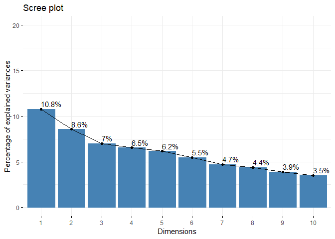<!-- -->

``` r
#visualize the contributions of each dimension.

#result
var_com <- get_pca_var(res_pca_com) 
var_com$coord
```

    ##                          Dim.1       Dim.2       Dim.3       Dim.4       Dim.5
    ## outcome            -0.25783005  0.60080510 -0.34069987  0.15037819 -0.08036646
    ## hypertensive        0.59483374  0.28592806  0.16502440 -0.18150167 -0.26703419
    ## atrialfibrillation  0.14209031  0.51476215 -0.05485570 -0.06376598  0.68275901
    ## chd_with_no_mi      0.06707659  0.11102265  0.00589259  0.81407706 -0.20221709
    ## diabetes            0.55211925  0.01323242 -0.22216159  0.13759880 -0.28196303
    ## deficiencyanemias   0.41346957 -0.48180259 -0.23759109 -0.05871588 -0.04896707
    ## depression          0.09698265 -0.37202974  0.38680307  0.47245831  0.44269305
    ## hyperlipemia        0.47873206  0.41529120  0.32718783  0.14149924 -0.04767970
    ## renal_failure       0.67776379 -0.06185586  0.03832322 -0.15248066  0.23103794
    ## copd               -0.22858585  0.10791595  0.77796480 -0.17184803 -0.23578612

``` r
#shown by correlation

fviz_pca_var(res_pca_com, col.var = "contrib", gradient.cols = c("#00AFBB", "#E7B800", "#FC4E07"))
```

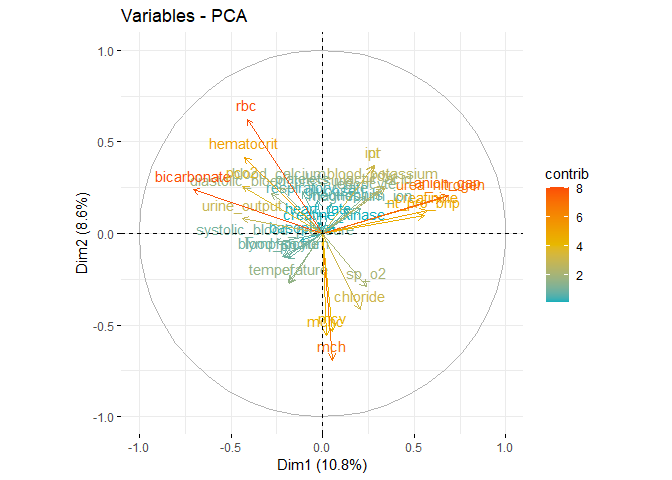<!-- -->

``` r
#based on above results (`var_com$coord`)
#basically,
#(a) positive correlated variables are grouped together,
#(b) negative correlated variables are located on opposite sides of the origin,
#(c) the distance between the variable and the origin measures the quality of the variable. Variables that are far from the origin are well represented.

corrplot(var_com$cos2, is.corr=FALSE)
```

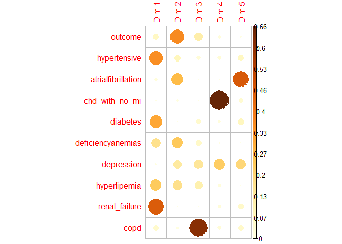<!-- -->

``` r
#shows the quality of variables.

var_com$contrib
```

    ##                         Dim.1       Dim.2       Dim.3      Dim.4      Dim.5
    ## outcome             3.9782595 28.22960842 10.40554010  2.1728261  0.6631569
    ## hypertensive       21.1746981  6.39368414  2.44127679  3.1653120  7.3215047
    ## atrialfibrillation  1.2082448 20.72291504  0.26975173  0.3906909 47.8631720
    ## chd_with_no_mi      0.2692576  0.96396405  0.00311267 63.6775412  4.1985790
    ## diabetes           18.2428129  0.01369356  4.42444325  1.8192171  8.1630215
    ## deficiencyanemias  10.2308833 18.15414877  5.06035514  0.3312580  0.2461925
    ## depression          0.5628778 10.82412848 13.41221521 21.4477749 20.1220402
    ## hyperlipemia       13.7154813 13.48786106  9.59654618  1.9238157  0.2334176
    ## renal_failure      27.4905074  0.29922605  0.13165722  2.2340084  5.4806642
    ## copd                3.1269772  0.91077042 54.25510171  2.8375557  5.7082513

``` r
#shown by contribution

fviz_contrib(res_pca_com, choice = "var", axes = 1, top = 10) 
```

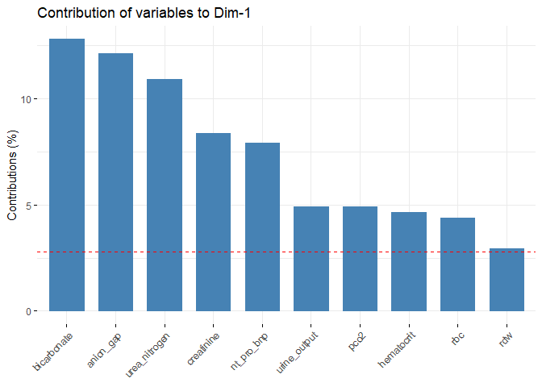<!-- -->

``` r
fviz_contrib(res_pca_com, choice = "var", axes = 1:5, top = 10) 
```

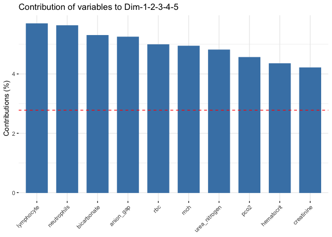<!-- -->

``` r
#pca for vital signs
sign_names = 
  sign_data |>
  select(heart_rate:ef) |>
  colnames()

#pca using R build-in function prcomp()
vars_sign = sign_data[, sign_names]
pca_res_sign = prcomp(vars_sign, scale. = TRUE)
summary(pca_res_sign)
```

    ## Importance of components:
    ##                           PC1    PC2     PC3    PC4     PC5     PC6     PC7
    ## Standard deviation     2.0755 1.7544 1.65941 1.5954 1.44825 1.41361 1.28211
    ## Proportion of Variance 0.1197 0.0855 0.07649 0.0707 0.05826 0.05551 0.04566
    ## Cumulative Proportion  0.1197 0.2052 0.28165 0.3524 0.41062 0.46613 0.51179
    ##                            PC8     PC9    PC10   PC11    PC12    PC13    PC14
    ## Standard deviation     1.26893 1.20539 1.13669 1.0732 1.06219 1.01594 0.97637
    ## Proportion of Variance 0.04473 0.04036 0.03589 0.0320 0.03134 0.02867 0.02648
    ## Cumulative Proportion  0.55652 0.59688 0.63277 0.6648 0.69610 0.72477 0.75125
    ##                          PC15    PC16    PC17    PC18    PC19    PC20    PC21
    ## Standard deviation     0.9411 0.93071 0.91478 0.88614 0.81928 0.78031 0.77131
    ## Proportion of Variance 0.0246 0.02406 0.02325 0.02181 0.01864 0.01691 0.01653
    ## Cumulative Proportion  0.7759 0.79992 0.82316 0.84498 0.86362 0.88053 0.89706
    ##                           PC22    PC23   PC24    PC25    PC26    PC27    PC28
    ## Standard deviation     0.74955 0.72039 0.7024 0.66146 0.64995 0.60204 0.52594
    ## Proportion of Variance 0.01561 0.01442 0.0137 0.01215 0.01173 0.01007 0.00768
    ## Cumulative Proportion  0.91267 0.92708 0.9408 0.95294 0.96467 0.97474 0.98242
    ##                           PC29    PC30    PC31    PC32    PC33    PC34    PC35
    ## Standard deviation     0.51135 0.46246 0.27123 0.26514 0.07778 0.07365 0.03573
    ## Proportion of Variance 0.00726 0.00594 0.00204 0.00195 0.00017 0.00015 0.00004
    ## Cumulative Proportion  0.98969 0.99563 0.99767 0.99962 0.99979 0.99994 0.99998
    ##                           PC36
    ## Standard deviation     0.02754
    ## Proportion of Variance 0.00002
    ## Cumulative Proportion  1.00000

``` r
#pca using packages `FactoMineR`, `factoextra`
res_pca_sign = PCA(sign_data, scale.unit = TRUE, graph = TRUE)
```

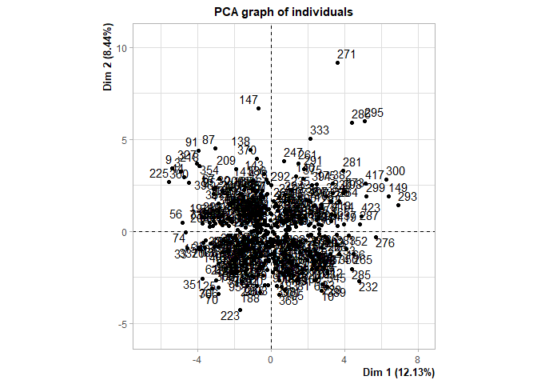<!-- -->

    ## Warning: ggrepel: 2 unlabeled data points (too many overlaps). Consider
    ## increasing max.overlaps

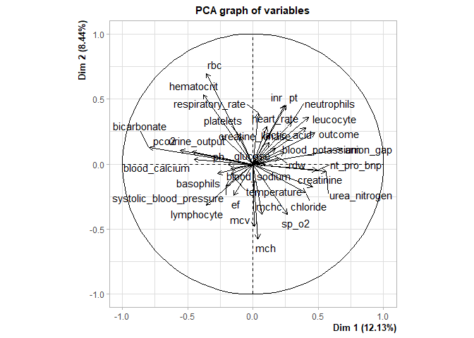<!-- -->

``` r
#PCA() function would do the data standardization automatically.
#keep 5 dimensions as result.

get_eigenvalue(res_pca_sign)
```

    ##         eigenvalue variance.percent cumulative.variance.percent
    ## Dim.1  4.486554762     12.125823680                    12.12582
    ## Dim.2  3.124558299      8.444752160                    20.57058
    ## Dim.3  2.754341576      7.444166421                    28.01474
    ## Dim.4  2.545338553      6.879293386                    34.89404
    ## Dim.5  2.167347085      5.857694824                    40.75173
    ## Dim.6  2.000577249      5.406965537                    46.15870
    ## Dim.7  1.643947209      4.443100565                    50.60180
    ## Dim.8  1.625781372      4.394003708                    54.99580
    ## Dim.9  1.457615819      3.939502214                    58.93530
    ## Dim.10 1.293181774      3.495085875                    62.43039
    ## Dim.11 1.152053351      3.113657706                    65.54405
    ## Dim.12 1.140232846      3.081710396                    68.62576
    ## Dim.13 1.032137271      2.789560193                    71.41532
    ## Dim.14 0.984959896      2.662053774                    74.07737
    ## Dim.15 0.939588449      2.539428240                    76.61680
    ## Dim.16 0.867945766      2.345799369                    78.96260
    ## Dim.17 0.837340648      2.263082832                    81.22568
    ## Dim.18 0.785724642      2.123580113                    83.34926
    ## Dim.19 0.688799473      1.861620196                    85.21088
    ## Dim.20 0.660627094      1.785478633                    86.99636
    ## Dim.21 0.607900214      1.642973552                    88.63933
    ## Dim.22 0.565506741      1.528396597                    90.16773
    ## Dim.23 0.542955354      1.467446904                    91.63518
    ## Dim.24 0.499994632      1.351336844                    92.98651
    ## Dim.25 0.493276693      1.333180250                    94.31969
    ## Dim.26 0.437271691      1.181815381                    95.50151
    ## Dim.27 0.421672417      1.139655181                    96.64116
    ## Dim.28 0.355470244      0.960730390                    97.60189
    ## Dim.29 0.265574370      0.717768568                    98.31966
    ## Dim.30 0.260431388      0.703868615                    99.02353
    ## Dim.31 0.205460121      0.555297623                    99.57883
    ## Dim.32 0.072365989      0.195583753                    99.77441
    ## Dim.33 0.069970192      0.189108628                    99.96352
    ## Dim.34 0.006041475      0.016328311                    99.97985
    ## Dim.35 0.005422769      0.014656132                    99.99451
    ## Dim.36 0.001274172      0.003443708                    99.99795
    ## Dim.37 0.000758404      0.002049740                   100.00000

``` r
#`variance.percent` explains the percentage of change. 70% would be adequate.

#scree plot
fviz_eig(res_pca_sign, addlabels = TRUE, ylim = c(0, 20))
```

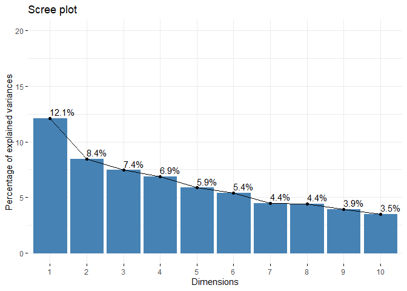<!-- -->

``` r
#visualize the contributions of each dimension.

#result
var_sign <- get_pca_var(res_pca_sign) 
var_sign$coord
```

    ##                                 Dim.1         Dim.2       Dim.3         Dim.4
    ## outcome                   0.476615774  0.2384592028 -0.02885000  0.0032038834
    ## heart_rate                0.106836586  0.2872528467  0.41739635  0.0900546938
    ## systolic_blood_pressure  -0.206550183 -0.1680294067  0.02456931  0.0613322078
    ## diastolic_blood_pressure -0.238262540  0.2151985656  0.26010128  0.3558984320
    ## respiratory_rate          0.041117513  0.3932669748  0.33166439  0.0479843882
    ## temperature              -0.168570306 -0.0790603519  0.46066515 -0.0698784025
    ## sp_o2                     0.262745239 -0.3860500783  0.07449164  0.0084513171
    ## urine_output             -0.467949250  0.0952373929  0.18390603  0.1040510743
    ## hematocrit               -0.381351278  0.5336291955  0.08784134  0.1984060048
    ## rbc                      -0.355532191  0.6976729627  0.01333505  0.2001303846
    ## mch                       0.038365969 -0.5746304274  0.39209359 -0.0006217516
    ## mchc                      0.071076525 -0.3886235328  0.55601483  0.0505959090
    ## mcv                       0.009700413 -0.4802922369  0.16156528 -0.0307115969
    ## rdw                       0.199415629  0.0485106757 -0.36559619  0.1192067530
    ## leucocyte                 0.424406488  0.3621198806  0.23899398 -0.1844723537
    ## platelets                -0.098538321  0.2136041099  0.16933643 -0.1071270999
    ## neutrophils               0.297006547  0.3216492952  0.07305974 -0.7296998481
    ## basophils                -0.269147756 -0.0743529567 -0.05422580  0.5822482894
    ## lymphocyte               -0.357214967 -0.3161136631 -0.07134289  0.7009691586
    ## pt                        0.251317183  0.4521528392 -0.06064512  0.0270531589
    ## inr                       0.244824206  0.4502600775 -0.06729796  0.0301049100
    ## nt_pro_bnp                0.491448471 -0.0469477763 -0.20758823  0.0526628973
    ## creatine_kinase           0.125540041  0.1632430863  0.16624951  0.0207383906
    ## creatinine                0.458169939 -0.1769007988 -0.38865952  0.3067058273
    ## urea_nitrogen             0.562069937 -0.0546878952 -0.48328910  0.0898283799
    ## glucose                   0.172681934  0.1230131587  0.13636553 -0.0097649955
    ## blood_potassium           0.239476792  0.0912177378 -0.34938870  0.2690716108
    ## blood_sodium             -0.170291633 -0.0358199916 -0.14460830 -0.3840835503
    ## blood_calcium            -0.451696681  0.0332454338 -0.14035639  0.1611860483
    ## chloride                  0.407564471 -0.2196432141  0.13739892 -0.2437860301
    ## anion_gap                 0.684253780  0.1146877636  0.02595635  0.4152753656
    ## magnesium_ion             0.093261489  0.0003682741 -0.23828815 -0.1039840619
    ## ph                       -0.192171714 -0.0041834239  0.47588843 -0.0091267263
    ## bicarbonate              -0.796414736  0.1251275966 -0.25609348 -0.2210588224
    ## lactic_acid               0.404578048  0.2792404705  0.35084559  0.2876576552
    ## pco2                     -0.555380763  0.1047247717 -0.52658698 -0.2243388307
    ## ef                       -0.146139703 -0.2408581011 -0.07825737 -0.3248713183
    ##                                 Dim.5
    ## outcome                   0.310229133
    ## heart_rate               -0.016935468
    ## systolic_blood_pressure  -0.300383049
    ## diastolic_blood_pressure -0.104202521
    ## respiratory_rate         -0.024514112
    ## temperature              -0.156446373
    ## sp_o2                    -0.233415421
    ## urine_output             -0.149763946
    ## hematocrit                0.369778583
    ## rbc                       0.083699926
    ## mch                       0.577654272
    ## mchc                      0.135599751
    ## mcv                       0.627995020
    ## rdw                      -0.141473721
    ## leucocyte                -0.071887906
    ## platelets                -0.413735400
    ## neutrophils              -0.103853518
    ## basophils                 0.111167086
    ## lymphocyte                0.075717356
    ## pt                        0.389923644
    ## inr                       0.393600819
    ## nt_pro_bnp               -0.065458986
    ## creatine_kinase           0.168275116
    ## creatinine               -0.150785189
    ## urea_nitrogen            -0.109214122
    ## glucose                  -0.090105948
    ## blood_potassium           0.079749470
    ## blood_sodium              0.259617752
    ## blood_calcium            -0.124509663
    ## chloride                  0.172261041
    ## anion_gap                -0.121760477
    ## magnesium_ion             0.001638978
    ## ph                       -0.340392532
    ## bicarbonate               0.081177178
    ## lactic_acid               0.179129466
    ## pco2                      0.285568453
    ## ef                       -0.010375779

``` r
#shown by correlation

fviz_pca_var(res_pca_sign, col.var = "contrib", gradient.cols = c("#00AFBB", "#E7B800", "#FC4E07"))
```

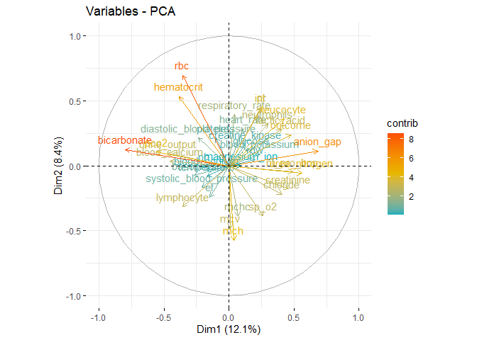<!-- -->

``` r
#based on above results (`var_com$coord`)

corrplot(var_sign$cos2, is.corr=FALSE)
```

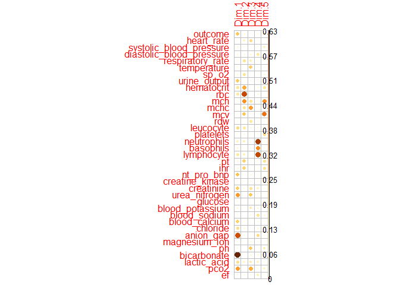<!-- -->

``` r
#shows the quality of variables.

var_sign$contrib
```

    ##                                 Dim.1        Dim.2        Dim.3        Dim.4
    ## outcome                   5.063185642 1.819867e+00  0.030218562 4.032811e-04
    ## heart_rate                0.254405812 2.640828e+00  6.325276246 3.186157e-01
    ## systolic_blood_pressure   0.950907326 9.036119e-01  0.021916337 1.477854e-01
    ## diastolic_blood_pressure  1.265314722 1.482143e+00  2.456219534 4.976300e+00
    ## respiratory_rate          0.037682587 4.949785e+00  3.993740996 9.045954e-02
    ## temperature               0.633357876 2.000455e-01  7.704650224 1.918405e-01
    ## sp_o2                     1.538709868 4.769783e+00  0.201463940 2.806101e-03
    ## urine_output              4.880727236 2.902862e-01  1.227931478 4.253511e-01
    ## hematocrit                3.241435906 9.113612e+00  0.280143231 1.546550e+00
    ## rbc                       2.817376492 1.557812e+01  0.006456118 1.573550e+00
    ## mch                       0.032807971 1.056790e+01  5.581638311 1.518757e-05
    ## mchc                      0.112600262 4.833587e+00 11.224188545 1.005739e-01
    ## mcv                       0.002097333 7.382824e+00  0.947716164 3.705606e-02
    ## rdw                       0.886350335 7.531579e-02  4.852723196 5.582853e-01
    ## leucocyte                 4.014681124 4.196779e+00  2.073748752 1.336956e+00
    ## platelets                 0.216419976 1.460261e+00  1.041077299 4.508719e-01
    ## neutrophils               1.966160975 3.311133e+00  0.193793165 2.091910e+01
    ## basophils                 1.614613404 1.769326e-01  0.106756453 1.331898e+01
    ## lymphocyte                2.844109561 3.198143e+00  0.184792198 1.930422e+01
    ## pt                        1.407768981 6.543075e+00  0.133528494 2.875348e-02
    ## inr                       1.335967018 6.488409e+00  0.164431854 3.560649e-02
    ## nt_pro_bnp                5.383230837 7.054097e-02  1.564543472 1.089592e-01
    ## creatine_kinase           0.351278491 8.528663e-01  1.003466651 1.689680e-02
    ## creatinine                4.678861716 1.001546e+00  5.484295231 3.695715e+00
    ## urea_nitrogen             7.041541466 9.571804e-02  8.480006733 3.170163e-01
    ## glucose                   0.664631370 4.843000e-01  0.675136204 3.746265e-03
    ## blood_potassium           1.278244373 2.662993e-01  4.432001755 2.844397e+00
    ## blood_sodium              0.646358775 4.106410e-02  0.759221702 5.795699e+00
    ## blood_calcium             4.547584997 3.537328e-02  0.715231462 1.020726e+00
    ## chloride                  3.702368677 1.543999e+00  0.685407516 2.334920e+00
    ## anion_gap                10.435696438 4.209646e-01  0.024460739 6.775273e+00
    ## magnesium_ion             0.193861567 4.340639e-06  2.061517842 4.248034e-01
    ## ph                        0.823125310 5.601123e-04  8.222284258 3.272537e-03
    ## bicarbonate              14.137271597 5.010921e-01  2.381108910 1.919863e+00
    ## lactic_acid               3.648309358 2.495560e+00  4.469040105 3.250920e+00
    ## pco2                      6.874936519 3.510025e-01 10.067518569 1.977258e+00
    ## ef                        0.476018103 1.856666e+00  0.222347755 4.146457e+00
    ##                                 Dim.5
    ## outcome                  4.440549e+00
    ## heart_rate               1.323323e-02
    ## systolic_blood_pressure  4.163153e+00
    ## diastolic_blood_pressure 5.009888e-01
    ## respiratory_rate         2.772706e-02
    ## temperature              1.129282e+00
    ## sp_o2                    2.513799e+00
    ## urine_output             1.034871e+00
    ## hematocrit               6.308920e+00
    ## rbc                      3.232375e-01
    ## mch                      1.539599e+01
    ## mchc                     8.483778e-01
    ## mcv                      1.819634e+01
    ## rdw                      9.234706e-01
    ## leucocyte                2.384422e-01
    ## platelets                7.897996e+00
    ## neutrophils              4.976385e-01
    ## basophils                5.701957e-01
    ## lymphocyte               2.645224e-01
    ## pt                       7.015048e+00
    ## inr                      7.147983e+00
    ## nt_pro_bnp               1.977016e-01
    ## creatine_kinase          1.306506e+00
    ## creatinine               1.049032e+00
    ## urea_nitrogen            5.503375e-01
    ## glucose                  3.746092e-01
    ## blood_potassium          2.934453e-01
    ## blood_sodium             3.109856e+00
    ## blood_calcium            7.152826e-01
    ## chloride                 1.369133e+00
    ## anion_gap                6.840443e-01
    ## magnesium_ion            1.239418e-04
    ## ph                       5.346032e+00
    ## bicarbonate              3.040461e-01
    ## lactic_acid              1.480490e+00
    ## pco2                     3.762634e+00
    ## ef                       4.967215e-03

``` r
#shown by contribution

fviz_contrib(res_pca_sign, choice = "var", axes = 1, top = 10)
```

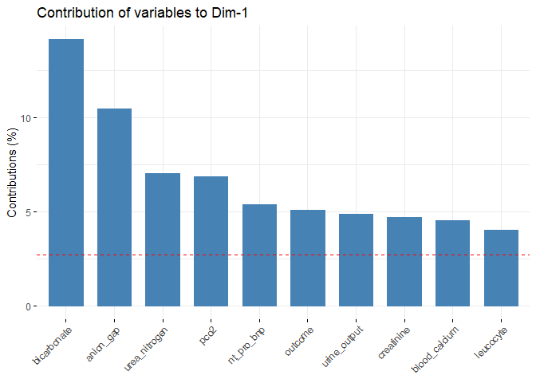<!-- -->

``` r
fviz_contrib(res_pca_sign, choice = "var", axes = 1:5, top = 10)
```

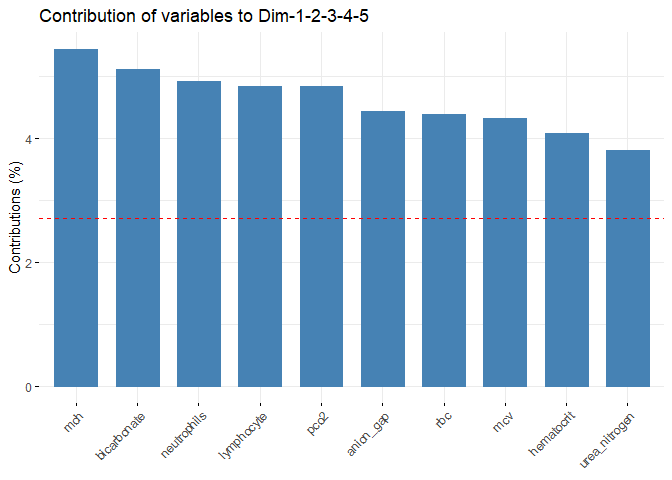<!-- -->
